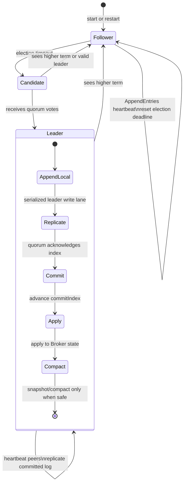
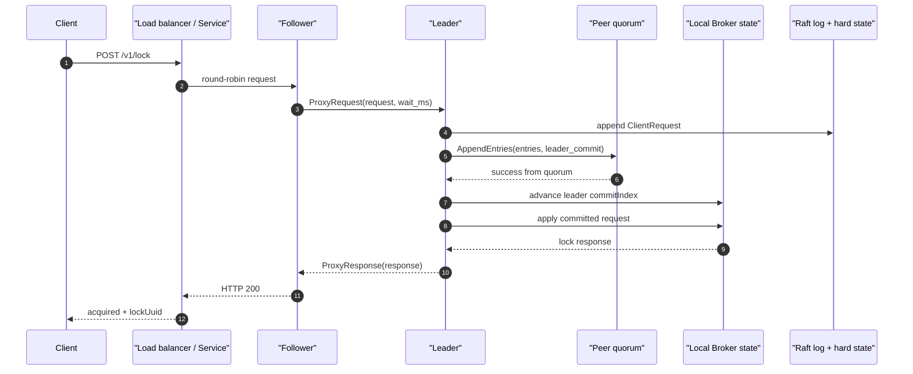
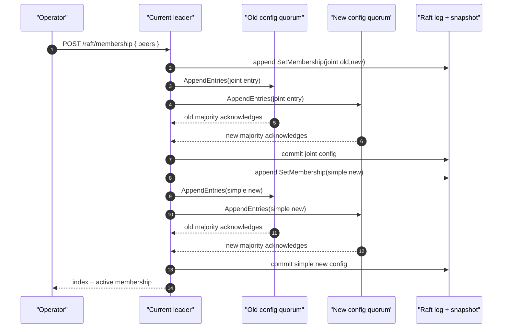
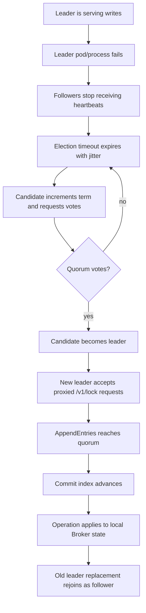

# BrokerRaft Architecture

BrokerRaft is the high-availability HTTP backend for `live-mutex-rs`.
It is a separate deployment from the regular single-node Broker: the
regular Broker keeps the TCP + HTTP API on one pod, while BrokerRaft runs
three or five HTTP-only pods with a Raft RPC peer service.

The leader orders lock operations. A quorum commits each operation before
the in-process broker state is changed. Followers can receive HTTP lock
requests from a round-robin load balancer and proxy them to the current
leader.

## Implementation Status

BrokerRaft implements the core Raft consensus mechanics used by this broker
path, but it is not yet an etcd/ZooKeeper-grade consensus system.

Implemented:

- leader election with `PreVote`, parallel `RequestVote` RPCs, and early quorum
  completion,
- PreVote and RequestVote term-disruption hardening: stale or partitioned nodes
  must prove a quorum would vote before incrementing/persisting their term, and
  fresh known-leader hints suppress disruptive higher-term vote requests while
  expired leader hints do not block liveness,
- malformed PreVote and RequestVote rejection before term/vote mutation for
  term-zero requests and impossible `lastLogIndex` / `lastLogTerm` summaries,
- check-quorum leader demotion: if the current leader cannot observe an active
  quorum for an election-timeout window, it steps down so `/raft/leaderz` stops
  advertising a partitioned leader,
- quorum-fresh leader readiness: write admission and `/raft/leaderz` require
  the leader role plus a recent quorum observation, so stale leaders reject
  writes before appending new log entries,
- a current-term no-op barrier appended and committed after a leader election,
- leader-ordered lock operations,
- quorum commit based on peer count, such as 2-of-3 or 3-of-5,
- leader commit advancement from `matchIndex` with Raft's current-term and
  still-leader commit restrictions,
- durable local term/vote hard state and append-only logs with persisted-log gap
  and term-regression validation on read, including
  latest-snapshot/log-boundary consistency checks,
- startup validation rejects durable `commitIndex` values ahead of the available
  latest-snapshot/log boundary instead of silently lowering a committed index
  after local data loss,
- leader and follower commit advancement persist `commitIndex` before applying
  committed entries, so restart replay cannot lose a locally committed operation,
- durable snapshots are treated as committed through `lastIncludedIndex` on
  startup, and live `InstallSnapshot` advances durable hard state before broker
  state observes the snapshot payload,
- live `InstallSnapshot` applies durable hard-state, membership, learner, and
  response-cache side effects before installing broker state, so sidecar
  persistence failures cannot partially replace the state machine,
- broker snapshot validation checks TTL deadline records against restored
  holders before install, closing a late-failure path in snapshot apply,
- synced atomic renames for hard state, snapshot files, sidecar learner state,
  and rewritten log segments; snapshot install fsyncs the new snapshot before
  rewriting the retained log suffix so restart recovery can trust the snapshot
  boundary,
- incremental `AppendEntries` with `prevLogIndex`, `prevLogTerm`,
  `nextIndex`, `matchIndex`, bounded catch-up batches, and retained
  snapshot-suffix catch-up before falling back to `InstallSnapshot`,
- progress-aware catch-up retries so successful bounded batches or conflict
  repairs advance immediately instead of waiting for the heartbeat cadence,
- follower log conflict detection and truncation repair,
- retained-log term indexing so leader conflict-hint repair can jump
  `nextIndex` without rereading the whole retained log file,
- follower `leaderCommit` advancement capped at the matched leader log index,
- post-commit `AppendEntries` fan-out so followers learn the updated
  `leaderCommit` promptly after quorum commit,
- non-quorum `AppendEntries` RPCs are detached instead of cancelled once a
  target write reaches quorum, so slow followers can still advance progress
  without delaying the client response,
- durable term persistence before replying to higher-term append failures,
- malformed `AppendEntries` rejection before leader/term mutation for
  term-zero requests, impossible previous-log summaries, non-contiguous indexes,
  and impossible future-term entries,
- membership-gated Raft RPC handling so unknown or removed peer IDs cannot
  advance local term, reset election timers, or install snapshots,
- optional shared peer-token authentication on Raft RPC frames before term,
  log, snapshot, or proxy handling,
- same-term leader conflict rejection for vote, append, and snapshot RPC paths,
- leader progress updates capped to the AppendEntries batch or snapshot actually
  sent, rather than trusting inflated follower response indexes,
- stale or delayed conflict responses cannot rewind a peer's `nextIndex` below
  its known `matchIndex + 1`, preserving the leader progress invariant under
  overlapping catch-up retries,
- volatile leader progress with `nextIndex` beyond the local log tail is
  clamped back to `lastLogIndex + 1` before replication so a bad in-memory
  progress value does not trigger unnecessary snapshot fallback,
- bounded leader-local client request batching for the HTTP write path,
- proposal-quorum failure demotion: if a leader appends a client entry but
  cannot commit that target index, it returns unavailable and steps down so load
  balancers stop routing fresh writes to it,
- deterministic lock UUID and fencing-token grant metadata in client-request log
  entries,
- Raft client IDs namespaced by a stable node-derived prefix, so `DropClient`
  cleanup entries from a new leader cannot collide with client IDs logged by a
  previous leader,
- chunked `InstallSnapshot` catch-up for followers behind the compacted prefix,
- active broker-state snapshots for holders, queued waiters, fencing counters,
  and TTL deadlines, staged on receiver disk before install,
- stale staged `InstallSnapshot` part cleanup, including orphaned transfer-file
  cleanup on restart plus invalid transfer discards such as offset mismatches,
  checksum failures, and staged byte-limit rejections, so abandoned chunk
  transfers do not leak disk indefinitely; successful removals sync the parent
  directory, and discarded files increment
  `dd_rust_network_mutex_raft_snapshot_transfer_cleanups_total`,
- duplicate non-final `InstallSnapshot` chunks, including delayed duplicate
  first chunks, are idempotently acknowledged without appending bytes twice or
  clearing the staged transfer, while real offset gaps still reset the transfer;
  follower-side staged chunks, staged bytes, duplicate chunks, offset
  mismatches, and local staged-file length mismatches are exposed in `/metrics`
  via counters including
  `dd_rust_network_mutex_raft_install_snapshot_staged_file_mismatches_total`,
- inbound `InstallSnapshot` chunks are decoded and checked against
  `raft.install_snapshot_chunk_bytes` before term/leader mutation; oversized
  chunks increment
  `dd_rust_network_mutex_raft_install_snapshot_oversized_chunks_total`,
- one staged `InstallSnapshot` transfer is capped by
  `raft.install_snapshot_max_staged_bytes`, with over-limit transfers discarded
  and counted in
  `dd_rust_network_mutex_raft_install_snapshot_staged_byte_limit_rejections_total`,
- concurrent staged `InstallSnapshot` transfers are capped by
  `raft.install_snapshot_max_staged_transfers`, with rejected transfer starts
  counted in
  `dd_rust_network_mutex_raft_install_snapshot_staged_transfer_limit_rejections_total`,
- SHA-256 snapshot payload checksums verified before snapshot install,
- log-backed dynamic membership changes through joint consensus via
  `GET/POST /raft/membership`,
- joint config entries commit under the joint old+new quorum, so an old
  majority alone cannot apply a membership transition,
- validation of replicated, persisted, and snapshotted membership payloads before
  they can alter quorum state,
- removed local nodes clear leader state, staged learners, progress, and pooled
  peer RPC connections when applying the new membership,
- same-id peer address changes reset leader progress and drop the old pooled RPC
  connection immediately when applying the new membership,
- same-id staged learner address changes reset learner progress and drop the
  old pooled RPC connection before the learner can satisfy catch-up,
- surviving local nodes clear any known leader or persisted vote target that is
  no longer active in the new membership before exposing the config change,
- startup recovery rechecks persisted votes after applying snapshot and committed
  membership state, so stale votes from removed peers are not carried across
  restart,
- transient learner catch-up for new peer IDs before joint-consensus promotion,
- required post-promotion catch-up so every newly promoted voter reaches the
  final membership log index before the membership change returns,
- if the final membership removes the local leader, the API returns the committed
  final membership index after applying the step-down instead of attempting
  leader-only post-promotion catch-up from a removed node,
- failed transient catch-up for a membership change removes only learners added
  for that attempt and preserves any operator-staged learner already recorded on
  disk,
- learner and new-voter catch-up runs peers concurrently and retries each peer
  immediately after bounded-batch progress instead of sleeping for the heartbeat
  interval between every batch,
- interrupted joint-consensus membership changes can be finished by reposting
  the exact joint config's new peer set, while different peer sets remain
  rejected until the final simple config is committed,
- joint-consensus `quorumSize` reporting uses the minimum unique ack count that
  can satisfy both old and new majorities, while commit checks still require
  `old-majority && new-majority`,
- operator progress inspection via `GET /raft/progress`, including per-peer
  `nextIndex`, `matchIndex`, lag, and staged-learner visibility,
- shared Broker/BrokerRaft latency histograms for perf runs:
  `dd_rust_network_mutex_request_duration_seconds` uses fixed route labels such
  as `http_acquire`, `raft_http_acquire`, and `stream_frame`, while
  `dd_rust_network_mutex_request_payload_bytes` buckets persistent TCP/UDS JSON
  frame sizes without key or request-id labels,
- Raft `/metrics` counters for append progress updates, conflict repairs, and
  conflict clamps:
  `dd_rust_network_mutex_raft_append_progress_updates_total`,
  `dd_rust_network_mutex_raft_append_conflict_repairs_total`, and
  `dd_rust_network_mutex_raft_append_conflict_clamps_total`; raw conflict hints
  that would move `nextIndex` above the failed probe or local log tail are
  capped and counted in
  `dd_rust_network_mutex_raft_append_conflict_high_clamps_total`; invalid
  `AppendEntries(success=true)` responses that underreport the matched boundary
  increment `dd_rust_network_mutex_raft_append_invalid_success_responses_total`;
  success responses that overreport beyond the sent batch are capped and
  increment `dd_rust_network_mutex_raft_append_capped_success_responses_total`;
  lower-term `AppendEntries` responses are treated as stale and increment
  `dd_rust_network_mutex_raft_append_stale_term_responses_total`;
  snapshot fallbacks from the append path increment
  `dd_rust_network_mutex_raft_append_snapshot_fallbacks_total`, split into
  `dd_rust_network_mutex_raft_append_snapshot_prev_term_misses_total` for
  compacted/missing `prevLogTerm` and
  `dd_rust_network_mutex_raft_append_snapshot_suffix_gaps_total` for retained
  suffix coverage gaps,
- leader-side AppendEntries attempt/outcome counters for perf comparisons:
  `dd_rust_network_mutex_raft_append_entries_requests_total`,
  `dd_rust_network_mutex_raft_append_entries_heartbeats_total`,
  `dd_rust_network_mutex_raft_append_entries_sent_total`,
  `dd_rust_network_mutex_raft_append_entries_wire_bytes_total`,
  `dd_rust_network_mutex_raft_append_entries_request_us_total`,
  `dd_rust_network_mutex_raft_append_entries_frame_clamps_total`,
  `dd_rust_network_mutex_raft_append_entries_successes_total`,
  `dd_rust_network_mutex_raft_append_entries_conflicts_total`, and
  `dd_rust_network_mutex_raft_append_entries_rpc_errors_total`;
  request microseconds measure cumulative time awaiting leader-side append RPC
  attempts, while serialized batches that would exceed the Raft RPC frame cap
  are shortened by exact frame sizing before the socket write and counted in the
  frame-clamp counter,
- follower-side malformed leader-RPC counters for frames rejected before
  leader/term mutation:
  `dd_rust_network_mutex_raft_append_entries_malformed_requests_total` and
  `dd_rust_network_mutex_raft_install_snapshot_malformed_requests_total`;
  sender rejections for unknown, stale, or conflicting leaders are counted in
  `dd_rust_network_mutex_raft_follower_append_sender_rejections_total` and
  `dd_rust_network_mutex_raft_follower_install_snapshot_sender_rejections_total`;
  generic inbound request/response frames rejected before JSON parsing because
  they exceed the frame cap increment
  `dd_rust_network_mutex_raft_rpc_inbound_frame_rejections_total`, and generic
  outbound request/response frames rejected before socket write increment
  `dd_rust_network_mutex_raft_rpc_outbound_frame_rejections_total`; under-cap
  request/response frames rejected because they cannot be decoded as the
  expected Raft JSON shape increment
  `dd_rust_network_mutex_raft_rpc_malformed_frames_total`; the same inbound
  frame-cap and malformed-frame paths emit debug-level `lmx::raft` events with
  node id, accepted peer socket address, configured frame cap, and decode error
  context, while outbound peer-response decode failures include peer id and RPC
  kind; logical outbound peer RPC attempts and their cumulative wait time are
  exported as `dd_rust_network_mutex_raft_rpc_outbound_requests_total` and
  `dd_rust_network_mutex_raft_rpc_outbound_request_us_total`;
  oversized snapshot chunks also increment
  `dd_rust_network_mutex_raft_install_snapshot_oversized_chunks_total`, while
  staged-transfer byte limit rejections increment
  `dd_rust_network_mutex_raft_install_snapshot_staged_byte_limit_rejections_total`
  and active staged-transfer limit rejections increment
  `dd_rust_network_mutex_raft_install_snapshot_staged_transfer_limit_rejections_total`,
- leader quorum-wait counters for user-visible Raft write latency:
  `dd_rust_network_mutex_raft_replication_quorum_waits_total`,
  `dd_rust_network_mutex_raft_replication_quorum_attempts_total`,
  `dd_rust_network_mutex_raft_replication_quorum_progress_retries_total`,
  `dd_rust_network_mutex_raft_replication_quorum_sleeps_total`,
  `dd_rust_network_mutex_raft_replication_quorum_successes_total`,
  `dd_rust_network_mutex_raft_replication_quorum_timeouts_total`,
  `dd_rust_network_mutex_raft_replication_quorum_leadership_losses_total`, and
  `dd_rust_network_mutex_raft_replication_quorum_wait_ms_total`; attempts count
  fan-out rounds, progress retries count immediate loop turns after peer
  `matchIndex`/`nextIndex` movement, and sleeps count heartbeat-delay waits when
  no peer made progress; replication responses from peers removed by membership
  churn are ignored for progress, excluded from normal success/conflict/rejection
  counters, and counted in
  `dd_rust_network_mutex_raft_replication_removed_peer_responses_total`,
- BrokerRaft request-flow counters and gauges for profiling where request time
  goes before, during, and after consensus:
  `dd_rust_network_mutex_raft_client_proposals_total`,
  `dd_rust_network_mutex_raft_client_proposal_quorum_failures_total`,
  `dd_rust_network_mutex_raft_client_queue_full_total`,
  `dd_rust_network_mutex_raft_client_batches_total`,
  `dd_rust_network_mutex_raft_client_batch_entries_total`,
  `dd_rust_network_mutex_raft_client_batch_errors_total`,
  `dd_rust_network_mutex_raft_client_cache_completed_hits_total`,
  `dd_rust_network_mutex_raft_client_cache_pending_hits_total`,
  `dd_rust_network_mutex_raft_client_cache_conflicts_total`,
  `dd_rust_network_mutex_raft_proxy_requests_forwarded_total`,
  `dd_rust_network_mutex_raft_proxy_requests_handled_total`,
  `dd_rust_network_mutex_raft_proxy_request_errors_total`,
  `dd_rust_network_mutex_raft_client_batch_pending`,
  `dd_rust_network_mutex_raft_client_batch_driver_active`, and
  `dd_rust_network_mutex_raft_client_response_cache_entries`; queue-full and
  batch-failure paths log warn-level `lmx::raft` events, while proxy forwarding
  and proxy errors log debug-level events with request id and leader hint fields,
- Raft `/metrics` counters for follower-side `AppendEntries` conflict
  responses and suffix repair work:
  `dd_rust_network_mutex_raft_follower_append_conflicts_total`,
  `dd_rust_network_mutex_raft_follower_append_rewrites_total`,
  `dd_rust_network_mutex_raft_follower_append_appended_entries_total`,
  `dd_rust_network_mutex_raft_follower_append_rewritten_entries_total`, and
  `dd_rust_network_mutex_raft_follower_append_truncated_entries_total`,
- Raft `/metrics` counters for leader-side `InstallSnapshot` chunk attempts,
  raw snapshot payload bytes, and snapshot-driven peer progress:
  `dd_rust_network_mutex_raft_install_snapshot_chunks_total`,
  `dd_rust_network_mutex_raft_install_snapshot_bytes_total`,
  `dd_rust_network_mutex_raft_install_snapshot_wire_bytes_total`,
  `dd_rust_network_mutex_raft_install_snapshot_request_us_total`,
  `dd_rust_network_mutex_raft_install_snapshot_payload_prepares_total`,
  `dd_rust_network_mutex_raft_install_snapshot_payload_prepare_us_total`,
  `dd_rust_network_mutex_raft_install_snapshot_payload_prepare_bytes_total`,
  `dd_rust_network_mutex_raft_install_snapshot_successes_total`,
  `dd_rust_network_mutex_raft_install_snapshot_rejections_total`,
  `dd_rust_network_mutex_raft_install_snapshot_rpc_errors_total`, and
  `dd_rust_network_mutex_raft_install_snapshot_progress_updates_total`;
  request microseconds measure cumulative time awaiting leader-side snapshot
  chunk RPC attempts;
  configured raw snapshot chunks whose serialized Raft RPC frame would exceed
  the frame cap after base64/JSON overhead are clamped by exact frame sizing and
  counted in
  `dd_rust_network_mutex_raft_install_snapshot_frame_chunk_clamps_total`; success
  responses received before the leader sends the final chunk are ignored for
  peer progress and counted in
  `dd_rust_network_mutex_raft_install_snapshot_premature_success_responses_total`;
  final success responses that underreport the installed snapshot index are
  ignored for progress and counted in
  `dd_rust_network_mutex_raft_install_snapshot_invalid_success_responses_total`;
  final success responses that overreport the installed snapshot index are
  capped to the sent snapshot boundary and counted in
  `dd_rust_network_mutex_raft_install_snapshot_capped_success_responses_total`;
  lower-term `InstallSnapshot` responses are treated as stale and counted in
  `dd_rust_network_mutex_raft_install_snapshot_stale_term_responses_total`,
- log-retention counters and gauges:
  `dd_rust_network_mutex_raft_log_compactions_total`,
  `dd_rust_network_mutex_raft_log_compacted_entries_total`,
  `dd_rust_network_mutex_raft_log_compaction_threshold_triggers_total`,
  `dd_rust_network_mutex_raft_log_compaction_cadence_triggers_total`,
  `dd_rust_network_mutex_raft_log_compaction_safety_skips_total`,
  `dd_rust_network_mutex_raft_log_write_rollbacks_total`,
  `dd_rust_network_mutex_raft_log_write_rollback_errors_total`,
  `dd_rust_network_mutex_raft_log_rewrite_temp_cleanups_total`,
  `dd_rust_network_mutex_raft_atomic_json_temp_cleanups_total`,
  `dd_rust_network_mutex_raft_log_trailing_partial_recoveries_total`,
  `dd_rust_network_mutex_raft_log_trailing_partial_recovery_errors_total`,
  `dd_rust_network_mutex_raft_log_retained_entries`,
  `dd_rust_network_mutex_raft_log_bytes`,
  `dd_rust_network_mutex_raft_last_log_index`,
  `dd_rust_network_mutex_raft_commit_index`,
  `dd_rust_network_mutex_raft_last_applied`,
  `dd_rust_network_mutex_raft_latest_snapshot_index`,
  `dd_rust_network_mutex_raft_latest_snapshot_age_ms`,
  `dd_rust_network_mutex_raft_snapshot_maintenance_age_ms`,
  `dd_rust_network_mutex_raft_log_compaction_eligible_index`,
  `dd_rust_network_mutex_raft_peer_max_lag_entries`,
  `dd_rust_network_mutex_raft_leader_quorum_age_ms`, and
  `dd_rust_network_mutex_raft_leader_ready`; log write rollback attempts and
  rollback failures also emit warn-level `lmx::raft` events with path, entry
  count, target byte length, and sync policy fields,
- consensus-replicated staged-learner management via `GET/POST/DELETE
  /raft/learners`, with a local restart cache and snapshot coverage; promotion
  still goes through log-backed joint consensus,
- staged learner additions/removals are blocked while joint consensus is active,
  so operator membership-management commands cannot interleave with an unfinished
  voter transition,
- conservative missing-progress repair: if leader progress for a peer is absent,
  catch-up starts from the retained snapshot/log boundary instead of assuming
  the follower already has the leader's tail,
- persistent Raft peer connection reuse for vote, append, snapshot, and follower
  proxy RPCs,
- pooled peer RPC response-type validation; a mismatched response resets the
  connection before retrying so a desynchronized stream is not reused, and
  increments `dd_rust_network_mutex_raft_rpc_response_mismatches_total`,
- malformed vote/pre-vote requests increment
  `dd_rust_network_mutex_raft_pre_vote_malformed_requests_total` or
  `dd_rust_network_mutex_raft_request_vote_malformed_requests_total` and emit
  debug-level `lmx::raft` rejection logs,
- lower-term `RequestVote` responses are ignored for election quorum and
  counted in
  `dd_rust_network_mutex_raft_request_vote_stale_term_responses_total`,
- cancellation-safe pooled peer RPC calls that drop a connection after an
  aborted in-flight request instead of risking stale response reuse,
- `TCP_NODELAY` on Raft peer RPC sockets to avoid small-frame delayed
  request/response stalls,
- buffered JSON serialization for append-log, rewritten-log, and snapshot file
  writes before the same fsync/atomic-rename durability steps,
- cached durable hard state with exact duplicate write elision, so repeated
  unchanged term/vote/commit persistence requests do not rewrite and fsync
  `raft-hard-state.json`,
- explicit `raft.sync_log` / `LMX_RAFT_SYNC_LOG` durability policy: the default
  keeps append-log fsyncs enabled, while `false` is reserved for unsafe
  throughput experiments that accept loss of the latest unsynced log writes
  after a crash,
- leader-local durable append/fsync work is offloaded from the async runtime's
  core workers before quorum replication begins, preserving durable-before-ack
  ordering without stalling unrelated HTTP and Raft RPC tasks on that worker,
- candidate self-vote term/vote persistence is offloaded from the election task,
  keeping election-time hard-state writes off async workers,
- leader-side commit finalization is offloaded as well, so persisted
  `commitIndex` advancement, in-order apply, and snapshot/compaction checks do
  not occupy the proposal or replication-progress async worker after quorum,
- leader step-down term/vote persistence is offloaded from live election,
  replication, request-admission, and quorum-loss async paths,
- live `RequestVote` handling is offloaded when it can persist term/vote hard
  state, avoiding election fsyncs on Raft peer RPC async workers,
- live follower-side `AppendEntries` receive handling is also offloaded to
  Tokio's blocking pool, so higher-term hard-state writes, durable
  append/truncate/repair, commit advancement, apply, and compaction checks do
  not occupy Raft peer RPC async workers while waiting on filesystem writes,
- `InstallSnapshot` receive handling runs on the blocking pool as well, keeping
  large chunk writes, checksum verification, JSON parsing, snapshot install, and
  retained-log rewrite work off core async peer-RPC workers,
- periodic snapshot/compaction maintenance also runs on the blocking pool, so
  snapshot serialization and retained-log rewrites do not pin an async worker,
- leader-local request batching with an early wake when the pending queue reaches
  the configured batch size,
- bounded leader-local client admission through `client_batch_max_pending`, so a
  stalled quorum rejects before appending new log entries instead of growing the
  pending queue without bound,
- bounded replicated HTTP request-id response caching for idempotent retries:
  repeated `/v1/lock` or `/v1/unlock` calls with the same `requestId` or
  idempotency header and the same payload return the cached response instead of
  appending a duplicate command; in-flight duplicate retries are suppressed
  before append, failed pre-append reservations are released, and the applied
  cache is rebuilt from committed identity log entries and carried in Raft
  snapshots, while mismatched payload reuse is rejected,
- coalesced post-commit `AppendEntries` fan-out, so bursty commits wake lagging
  peers promptly without spawning one background replication task per commit,
- leader-aware HTTP routing support via `/raft/leaderz`, with `/raft/status`
  exposing `currentTerm`, `commitIndex`, `lastApplied`, `isLeaderReady`,
  `leaderQuorumAgeMs`, and `leaderQuorumTimeoutMs` for convergence and stale
  leader checks,
- conservative local snapshot/compaction for disk control,
- overdue snapshot cadence is honored opportunistically from the commit/apply
  path as well as the maintenance loop, while retained-suffix settings still
  block unsafe deletion.

Still missing:

- deeper hot-path pipelining beyond the serialized commit/apply lane,
- production hardening comparable to etcd or ZooKeeper.

That means BrokerRaft should currently be treated as an experimental
high-availability broker backend, not as a finished distributed lock service.

## State Diagram



## Lock Commit Sequence



If the load balancer can prefer the leader, it should use
`GET /raft/leaderz` as the leader-only health check. That removes the proxy
hop shown above. Correctness does not depend on leader-aware routing, because
followers proxy writes and the leader still requires quorum before applying.
An old leader that cannot observe quorum for an election-timeout window steps
down, causing `/raft/leaderz` to return 503 instead of keeping a partitioned
leader in the preferred LB target set.
Likewise, a leader that can still contact peers but cannot commit a specific
client proposal steps down before returning `QuorumUnavailable`; that response
means the request was not applied locally, but, as with normal Raft client
semantics, a caller should treat the final outcome as unknown if another future
leader had already received the entry.
HTTP callers can reduce duplicate retries by supplying `requestId`,
`X-LMX-Request-Id`, `Idempotency-Key`, or `X-Idempotency-Key`. BrokerRaft records
identity-bearing HTTP write commands in the replicated log and caches a bounded
set of responses by request id and request fingerprint. While the first request
is still queued in the leader batch, duplicate retries observe the in-flight
reservation instead of appending another command. Once applied, the cache is
rebuilt during committed-log replay and included in Raft snapshots, so recent
completed retries can survive restart, compaction, and leadership transfer.
This is still a bounded retry hardening layer, not a full etcd-style
client-session lease or unbounded exactly-once ledger.
The raw Raft role is still exposed in status as `isLeader`, while
`isLeaderReady` is the load-balancer/write-admission signal. The
`leaderQuorumAgeMs` and `leaderQuorumTimeoutMs` fields show how recently the
leader observed an active quorum and when that readiness expires.
The current leader write path is still serialized, and each committed lock
operation is durably written before applying. Followers now receive incremental
log suffixes instead of a full-log rewrite on every append. Lagging followers
receive bounded `AppendEntries` batches, controlled by
`append_entries_max_entries` and `append_entries_max_bytes`, and Raft peer RPCs
reuse open TCP connections, including follower-to-leader proxy requests. The
leader serves `prevLogTerm`, bounded entry
batches, commit-range reads, and retained-term conflict hints from a validated
in-memory retained-log cache, using index lower-bound lookups for retained
suffix/range selection plus exact retained-index lookup for `prevLogTerm`,
avoiding repeated filesystem parsing in the hot replication/apply path. The
retained cache also tracks each entry's serialized JSON byte length so
`append_entries_max_bytes` enforcement does not repeatedly reserialize old log
entries while building catch-up batches. If a follower is only slightly behind a
snapshot
boundary, the leader first uses retained trailing log entries for incremental
catch-up; it sends `InstallSnapshot` only after the required previous-log term
has been compacted away. Debug-level `lmx::raft` snapshot-fallback logs include
peer, `nextIndex`, previous index, local tail, snapshot boundary, and target
index so flamegraph/perf runs can be correlated with replication state. The
follower also records conflict-response, append-only, and suffix-rewrite
counters so profiling runs can distinguish normal catch-up from expensive local
log repair. Follower suffix repair uses lower-bound retained-log slicing to
keep the retained prefix instead of scanning it entry by entry, then truncates
the log file at the retained-prefix byte offset and appends the leader suffix
instead of rewriting the full retained log. The in-memory retained entries,
serialized-byte cache, and term indexes are truncated and extended in place
after the disk write succeeds, so conflict repair does not clone a large
retained prefix. If that write path reports an error, the retained
log/index/byte cache is reloaded from disk before the follower returns the
failure. Append-only and truncate-and-append log writers roll the file length
back on write/flush/sync failure so partial suffix bytes are not left behind.
Follower snapshot install also keeps any matching retained suffix with an
indexed retained-log slice instead of clone-filtering the full retained cache.
Leader snapshot fan-out prepares the snapshot payload once per replication round
and shares the serialized bytes across peers that fall back to
`InstallSnapshot`, so two lagging peers do not reread and reserialize the same
snapshot independently.
Follower snapshot staging treats duplicate already-covered non-final chunks as
idempotent, and treats a new offset-0 chunk that is not a pure duplicate as a
transfer restart: the older staged file is removed before the replacement chunk
is written. This avoids forcing an extra failed retry when a leader restarts
`InstallSnapshot` after a lost response or reconnect.
Snapshot-backed compaction also keeps the retained suffix with an upper-bound
slice and exposes compaction counters plus retained-log gauges, so CPU profiles
can be correlated with actual disk-retention pressure. Unbounded full-log
read/replace helpers are test-only; production replication uses bounded suffix
or exact range reads.
The leader can coalesce concurrent client requests into
bounded append/replicate/commit batches. Under load, the serialized write lane
drains up to `client_batch_max_entries * client_pipeline_max_batches` pending
requests into one quorum round, and the coalescer wakes early when a batch fills
instead of always paying the full coalescing delay. The leader-local waiting
queue is bounded by `client_batch_max_pending`; overflow requests fail before
log append, so they do not create partially replicated lock operations.
Committed
entries are applied from `lastApplied + 1` through `commitIndex`, so uncommitted
tail entries are not materialized during apply. Compaction maintenance uses
retained-entry metadata and log file size before parsing retained entries, so
ordinary commits below snapshot thresholds do not scan the whole log.
After a quorum commits a write, slow non-quorum peers do not block the
successful client path. Any in-flight replication to those peers is allowed to
finish in the background, and the heartbeat loop handles anything still lagging.
The commit lane still applies committed entries in order, but bursty client
writes no longer require one quorum round per configured request batch.
Post-commit follower wakeups are coalesced through one active fan-out worker:
additional commits while that worker is running schedule another round instead
of spawning overlapping background replication tasks.
Local append-log and snapshot serialization is buffered before fsync, reducing
small write syscall churn. With the default `raft.sync_log = true`,
leader-local append/fsync work, candidate self-vote persistence, leader-side
commit finalization, leader step-down persistence, live `RequestVote` handling,
and live follower-side `AppendEntries` receive handling run on Tokio's blocking
pool, so the consensus write still waits for required disk durability but
ordinary async workers are not occupied by blocking filesystem calls.
Leader-side `InstallSnapshot` payload preparation also runs there before fan-out
chunking, so reading, checksumming, and serializing a large snapshot does not pin
an async replication worker. `InstallSnapshot` receive handling also runs there,
so large snapshot chunk writes, checksum verification, JSON parsing, snapshot
install, and retained-log rewrites do not block core peer-RPC workers. Periodic
snapshot/compaction maintenance uses the same blocking pool boundary.
Snapshot apply emits structured `lmx::raft` tracing at the hard-state,
membership, learner, broker-install, and final runtime-index boundaries so
operators can see where an install stopped without inferring from files alone.
Append progress and conflict repair emit debug-level `lmx::raft` events with
the previous and repaired `nextIndex`/`matchIndex`, the sent batch boundary, and
whether a stale conflict hint was clamped by known follower progress.
Impossible `AppendEntries(success=true)` responses that report a `matchIndex`
below the matched previous entry or sent batch are rejected as non-progress and
counted in the invalid-success metric.
Hard state is cached after startup and after successful durable writes; an
identical term/vote/commit write is elided, while a changed hard state still
uses the same fsync and atomic rename path before the cache is updated.
Setting `raft.sync_log = false` skips append-log fsyncs and parent-directory
syncs on append/rewrite paths; it can be useful for isolating disk-sync cost in
benchmarks, but it weakens crash durability and should not be used for
etcd/ZooKeeper-style safety claims.
When a replication round changes a peer's `nextIndex` or `matchIndex`, the
leader retries immediately; it sleeps for the heartbeat interval only when the
round made no progress. The retry loop tracks this with a monotonic
leader-progress generation counter, so it does not clone the whole peer progress
map on every bounded catch-up round.
Hot leader checks use a nonblocking role/term cache, and follower proxying uses
a cached leader peer hint when the runtime mutex is contended, so LB-routed HTTP
traffic and heartbeat tasks do not pile up behind unrelated Raft state work.
Follower/candidate election maintenance sleeps until the current election
deadline instead of polling the runtime mutex every 20 ms; failed election
attempts still back off briefly before retrying.
Demotion paths publish non-leader before slow hard-state writes, while write
admission still verifies leader readiness through the normal quorum/term checks.

## Profiling

BrokerRaft has a symbol-preserving Cargo profile for CPU profiling:

```bash
cargo test --no-default-features --profile profiling --test raft_cluster --no-run
```

The helper script profiles the local Raft cluster workload used by the failover
tests:

```bash
scripts/profile-raft.sh sample
scripts/profile-raft.sh perf
scripts/profile-raft.sh flamegraph
```

`sample` is the macOS fallback. It requires Apple profiling permissions and may
require full Xcode/Instruments or `sudo` on some hosts. Linux production-like
profiling should use `perf` or `cargo flamegraph` on the EC2/k8s node:

```bash
cargo install flamegraph
TEST_FILTER=raft_lb_seeded_lock_model_fuzz scripts/profile-raft.sh perf
TEST_FILTER=raft_lb_seeded_lock_model_fuzz scripts/profile-raft.sh flamegraph
```

The script sets frame pointers and uses the `profiling` profile so optimized
builds still produce useful symbols. The default target is
`tests/raft_cluster.rs::raft_lb_seeded_lock_model_fuzz`, because it exercises
leader election, follower proxying, quorum commit, and load-balanced failover.

The regular single-node Broker can be profiled as the baseline too. This script
builds the profiling binary, starts a local HTTP Broker, runs the
`redis_vs_raft_bench` workload with `BENCH_TARGET=broker`, and profiles the
Broker server process rather than the benchmark client:

```bash
scripts/profile-broker.sh sample
scripts/profile-broker.sh perf
scripts/profile-broker.sh flamegraph
```

Use the same benchmark knobs for both scripts, for example:

```bash
BENCH_WORKERS=16 BENCH_KEYS=256 BENCH_DURATION_MS=10000 scripts/profile-broker.sh perf
```

Local loopback benchmark evidence from 2026-06-05, using a leader-preferred
3-node cluster, 8 workers, 256 keys, and short-lived HTTP connections per
request: the default `raft.sync_log = true` path completed about 319 successful
acquire/release cycles/sec with p50 cycle latency near 24.031 ms. Re-running the
same benchmark with unsafe `raft.sync_log = false` completed about 1,072
cycles/sec with p50 near 6.832 ms. That gap is expected: the safe path waits for
leader and follower durable log syncs, while the unsafe path is only useful to
isolate disk-sync cost and does not make etcd/ZooKeeper-style crash-durability
claims.

Leader-side `commitIndex` advancement and follower `leaderCommit` advancement
are persisted before applying committed entries, so a restarted node can replay
locally committed operations from hard state. With the default
`raft.sync_log = true`, entries are durable before acknowledgement and commit
progress is persisted before local state-machine apply.

## Membership Change Sequence



The joint entry is committed using the joint old+new config. Both the old and
new configs must acknowledge it before the leader applies the transition, and
the final simple config must also be acknowledged by a majority of both configs.
This is Raft's quorum safety rule; it does not remove the leader's job of
ordering operations.
If a leader dies after committing the joint config but before committing the
final simple config, the next leader can finish the in-flight change by
submitting the same new peer set again. A different peer set is rejected until
the joint config is closed.

## Failover Event Trace



## Log Compaction Rule

BrokerRaft does not delete old committed log entries just because they are
older than a wall-clock threshold. Instead it writes a durable snapshot and
compacts entries only when all of these are true:

- the entries are committed,
- the entries are applied,
- the snapshot covers the compacted index.

The snapshot stores active holders, queued waiters, fencing counters, and TTL
deadlines, so a node can restart or receive `InstallSnapshot` without losing
the deterministic lock/queue state. Restored waiters keep their original client
ids for later replicated `DropClient` cleanup, but their old HTTP response
channels are not resurrected after restart or snapshot install.
