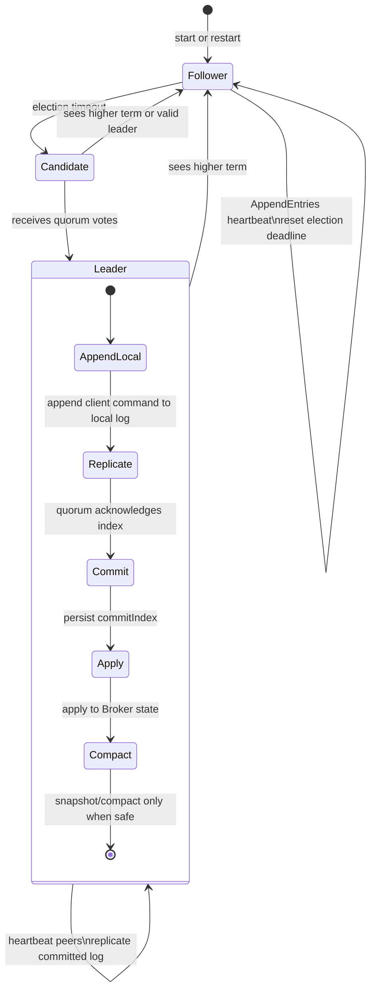
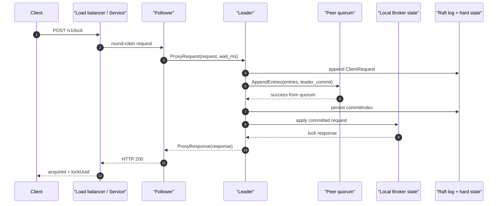
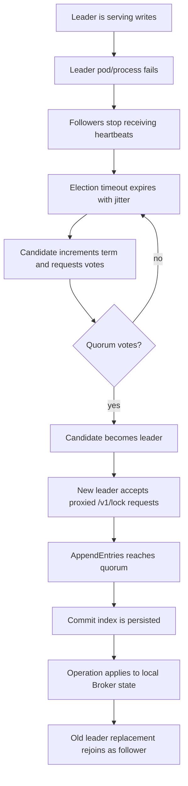

# BrokerRaft Architecture

BrokerRaft is the high-availability HTTP backend for `live-mutex-rs`.
It is a separate deployment from the regular single-node Broker: the
regular Broker keeps the TCP + HTTP API on one pod, while BrokerRaft runs
three or five HTTP-only pods with a Raft RPC peer service.

The leader orders lock operations. A quorum commits each operation before
the in-process broker state is changed. Followers can receive HTTP lock
requests from a round-robin load balancer and proxy them to the current
leader.

## State Diagram

## Lock Commit Sequence

If the load balancer can prefer the leader, it should use
`GET /raft/leaderz` as the leader-only health check. That removes the proxy
hop shown above. Correctness does not depend on leader-aware routing, because
followers proxy writes and the leader still requires quorum before applying.

## Failover Event Trace

## Log Compaction Rule

BrokerRaft does not delete old committed log entries just because they are
older than a wall-clock threshold. Instead it writes a durable snapshot and
compacts entries only when all of these are true:

- the entries are committed,
- the entries are applied,
- the snapshot covers the compacted index,
- the local Broker state is idle.

That conservative rule saves disk during idle periods while preserving replay
safety for live locks and waiters.
