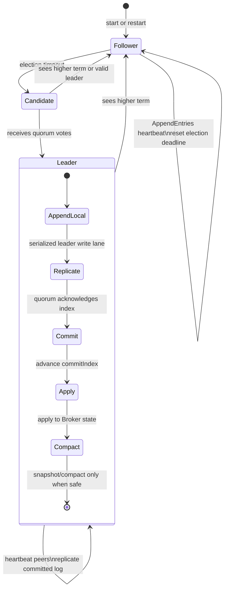
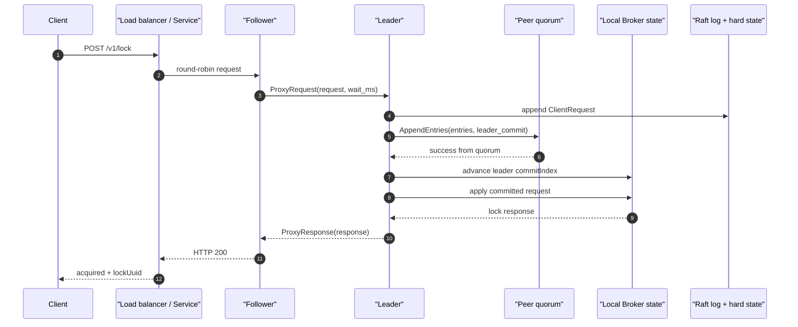
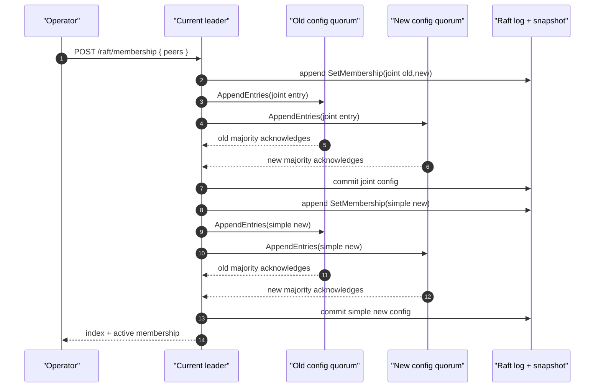
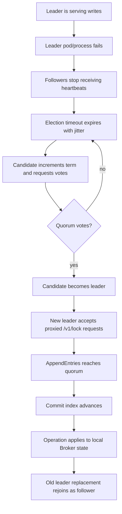

# BrokerRaft Architecture

BrokerRaft is the high-availability HTTP backend for `live-mutex-rs`.
It is a separate deployment from the regular single-node Broker: the
regular Broker keeps the TCP + HTTP API on one pod, while BrokerRaft runs
three or five HTTP-only pods with a Raft RPC peer service.

The leader orders lock operations. A quorum commits each operation before
the in-process broker state is changed. Followers can receive HTTP lock
requests from a round-robin load balancer and proxy them to the current
leader.

## Load-balancer leader routing

A dumb round-robin LB works because followers transparently proxy writes to the
leader. To route directly to the leader (skipping the proxy hop), a smarter LB
has two options:

- **Health-check probe:** `GET /raft/leaderz` returns `200` only on the ready
  leader and `503` otherwise. Use it as the LB health check so traffic lands on
  the leader. `GET /raft/status` exposes `isLeader`/`leaderId`/`leaderAddr` for
  discovery.
- **Response headers:** every HTTP response carries the responding node's view
  of leadership, so a client or LB can learn the leader from any response (e.g.
  a normal `/v1/lock`) without a separate probe:
  - `X-Raft-Node-Id`
  - `X-Raft-Role: leader|candidate|follower`
  - `X-Raft-Term`, `X-Raft-Commit-Index`, `X-Raft-Last-Applied`
  - `X-Raft-Last-Log-Index`, `X-Raft-Last-Log-Term`
  - `X-Raft-Leader-Ready: true|false` (whether this node can currently serve writes)
  - `X-Raft-Leader-Quorum-Age-Ms` on leaders, and `X-Raft-Leader-Quorum-Timeout-Ms`
  - `X-Raft-Membership-Joint`
  - `X-Raft-Sync-Log`, `X-Raft-Sync-Commit`, `X-Raft-Unsafe-Durability`
  - `X-Raft-Leader-Id` / `X-Raft-Leader-Addr` (the leader this node knows of)

  The hint can be briefly stale during a failover; the follower proxy fallback
  still guarantees correctness regardless of where a request lands. The raw TCP
  lock protocol carries no leader header — it relies on the follower proxy.

## Implementation Status

BrokerRaft implements the core Raft consensus mechanics used by this broker
path, but it is not yet an etcd/ZooKeeper-grade consensus system.

Implemented:

- leader election with `PreVote`, parallel `RequestVote` RPCs, and early quorum
  completion,
- startup and reset election deadlines use stable node/tick jitter inside the
  configured timeout window, reducing synchronized first elections and repeated
  split-vote wakeups in fresh clusters,
- PreVote and RequestVote term-disruption hardening: stale or partitioned nodes
  must prove a quorum would vote before incrementing/persisting their term, and
  fresh known-leader hints suppress disruptive higher-term vote requests while
  expired leader hints do not block liveness,
- same-term `RequestVote` grants after an expired known-leader hint clear that
  stale leader hint, so the elected candidate's same-term `AppendEntries` is not
  rejected as a conflicting leader,
- malformed PreVote and RequestVote rejection before term/vote mutation for
  term-zero requests and impossible `lastLogIndex` / `lastLogTerm` summaries,
- check-quorum leader demotion: if the current leader cannot observe an active
  quorum for an election-timeout window, it steps down so `/raft/leaderz` stops
  advertising a partitioned leader,
- quorum-fresh leader readiness: write admission and `/raft/leaderz` require
  the leader role plus a recent quorum observation, so stale leaders reject
  writes before appending new log entries,
- a current-term no-op barrier appended and committed after a leader election,
- leader-ordered lock operations,
- quorum commit based on peer count, such as 2-of-3 or 3-of-5,
- leader commit advancement from `matchIndex` with Raft's current-term and
  still-leader commit restrictions,
- durable local term/vote hard state and append-only logs with persisted-log gap
  and term-regression validation on read, including
  latest-snapshot/log-boundary consistency checks,
- startup validation rejects durable `commitIndex` values ahead of the available
  latest-snapshot/log boundary instead of silently lowering a committed index
  after local data loss,
- startup retained-log validation replays membership commands from the recovered
  snapshot/config membership before committed replay and checks retained
  request-id fingerprints against snapshot-cached idempotency entries, rejecting
  old context-invalid staged learner entries or duplicate request identities
  that would conflict during apply,
- leader and follower commit advancement persist `commitIndex` before applying
  committed entries, so restart replay cannot lose a locally committed operation,
- commit-only hard-state advancements use a bounded two-slot checksummed
  sidecar (`raft-hard-state-commit.slots`) that is fsynced before in-memory
  commit moves; term/vote changes still use the atomic JSON hard-state file,
  and startup combines the JSON base with the newest valid commit slot,
- step-down reads back the effective monotonic hard state and applies any newly
  visible durable `commitIndex`, so a term change cannot leave live runtime
  state behind a commit that was already persisted,
- accepted follower `AppendEntries` requests also sync the effective durable
  `commitIndex` into runtime before conflict repair, so stale in-memory state
  cannot permit a rewrite of an entry that disk already records as committed;
  follower log repair also rechecks the durable hard-state commit index while
  holding the log-state lock, so a concurrent commit advancement cannot be
  missed by a stale prepared runtime argument;
  after applying that durable commit, the follower rechecks term, leader, and
  membership before accepting any new entries from the sender,
- pre-vote round startup and candidate election startup apply any newly visible
  durable `commitIndex` before checking whether the local node is still an
  active voter, so a node removed by committed membership cannot count a stale
  local pre-vote or self-vote into a new term from stale runtime membership,
- pre-vote and candidate vote collection bind quorum checks to the membership
  snapshot observed at round start and abandon the round if committed membership
  changes before success, so votes gathered under one config are not mixed into
  leadership under another,
- valid `PreVote` and `RequestVote` handling follow the same durable-commit
  rule before checking local/candidate voter membership, so a candidate removed
  by an already-committed membership entry cannot receive election support from
  stale runtime state; if the visible durable commit is backed by a snapshot
  whose payload or sidecars cannot be applied yet, the vote paths return an
  error instead of granting from stale live state,
- durable snapshots are treated as committed through `lastIncludedIndex` on
  startup, and live `InstallSnapshot` advances durable hard state before broker
  state observes the snapshot payload,
- startup validates the broker-state portion of a recovered snapshot before it
  normalizes durable `commitIndex` to that snapshot boundary, so an invalid
  broker snapshot cannot fail reopen after advancing hard state on disk,
- local snapshot writes are monotonic: exact duplicate snapshot metadata and
  payload are idempotent, while older snapshot indexes or same-index term/payload
  changes are rejected before replacing durable snapshot state; if the retained
  log still contains the snapshot boundary entry, its term must match the
  requested `lastIncludedTerm`, and a local snapshot cannot cover future indexes
  beyond a non-empty retained log,
- committed range reads verify continuous coverage from either the latest
  snapshot boundary or retained log entries, so a retained-log prefix gap cannot
  silently skip committed entries while still allowing snapshot-covered suffix
  catch-up,
- live `InstallSnapshot` applies durable hard-state, membership, learner, and
  response-cache side effects before installing broker state, so sidecar
  persistence failures cannot partially replace the state machine,
- live `InstallSnapshot` validates snapshot-carried idempotency cache entries
  against any retained log suffix before writing the new snapshot/rewrite, so a
  snapshot cannot install request-id state that will conflict during later
  suffix replay,
- committed-entry apply failures, such as membership or learner sidecar
  persistence errors, increment
  `dd_rust_network_mutex_raft_apply_committed_errors_total` and emit a
  structured `lmx::raft` error with entry index, term, command kind, and the
  current apply boundary,
- broker snapshot validation checks TTL deadline records against restored
  holders before install, closing a late-failure path in snapshot apply,
- synced atomic renames for hard state, snapshot files, sidecar learner state,
  and rewritten log segments; snapshot install fsyncs the new snapshot before
  rewriting the retained log suffix so restart recovery can trust the snapshot
  boundary,
- incremental `AppendEntries` with `prevLogIndex`, `prevLogTerm`,
  `nextIndex`, `matchIndex`, bounded catch-up batches, and retained
  snapshot-suffix catch-up before falling back to `InstallSnapshot`,
- progress-aware catch-up retries so successful bounded batches or conflict
  repairs advance immediately instead of waiting for the heartbeat cadence,
- target-index quorum rounds seed acks from existing leader `matchIndex`
  progress, so already-caught-up peers do not receive redundant append RPCs
  before the leader can commit or return a membership catch-up result; cached
  progress does not refresh the check-quorum freshness timestamp,
- already-committed target-index waits prefer a real `matchIndex` quorum and
  only fall back to a minimal durable committed quorum when volatile leader
  progress is not strong enough after restart or leadership churn,
- generic leader replication rounds and quorum waits abandon accounting if the
  active membership changes after peer selection, so stale fan-out cannot
  commit, refresh leader freshness, or linger until the normal quorum timeout
  using an older voter set,
- election promotion seeds leader replication progress from the live runtime
  membership and staged learners at win time, so membership changes racing with
  vote fan-out cannot leave removed peers in the new leader's progress map,
- follower log conflict detection and truncation repair,
- deterministic fuzz coverage for follower conflict repair convergence from an
  optimistic `nextIndex` through conflict hints and bounded batches,
- retained-log term indexing so leader conflict-hint repair can backtrack
  `nextIndex` without rereading the whole retained log file,
- compacted-prefix conflict hints below the leader's retained snapshot/log floor
  force the next repair round through `InstallSnapshot` when they have no
  conflict term, or a conflict term the leader no longer has, instead of looping
  on an unavailable `prevLogIndex`,
- follower `leaderCommit` advancement capped at the matched leader log index,
- post-commit `AppendEntries` fan-out so followers learn the updated
  `leaderCommit` promptly after quorum commit, with bounded inline
  `AppendEntries` catch-up for lagging no-target heartbeat/post-commit fanout
  peers before yielding; yielded lagging peers now schedule another coalesced
  post-commit fan-out worker even if the original detached task finishes after
  the previous worker has gone idle,
- loopback failover coverage now waits for surviving voters' `commitIndex` and
  `lastApplied` to converge across acquire, release, and reacquire operations
  after the old leader is killed,
- loopback failover coverage also sends a client request to a surviving follower
  during the leaderless window after the old leader is killed, proving the
  follower proxy retry budget can bridge stale leader hints and real election
  churn,
- non-quorum `AppendEntries` RPCs are detached instead of cancelled once a
  target write reaches quorum or a no-target heartbeat/fan-out round observes an
  active quorum, so slow followers can still advance progress without delaying
  the client path or post-commit fan-out worker,
- durable term persistence before replying to higher-term append failures,
- malformed `AppendEntries` rejection before leader/term mutation for
  term-zero requests, impossible previous-log summaries, non-contiguous indexes,
  and impossible future-term entries,
- follower `prevLogIndex`/`prevLogTerm` conflicts return normal Raft conflict
  hints before staged-learner context validation, so stale leaders cannot force
  an unapplied membership scan for entries the follower will reject anyway,
- context-invalid staged learner entries are rejected before follower log write
  when they conflict with the active membership implied by applied plus
  unapplied local membership entries,
- context-invalid request-id entries are rejected before follower log write
  when their fingerprints conflict with retained or snapshotted idempotency
  context,
- same-index/same-term AppendEntries whose command differs from the retained
  local entry are rejected as log-matching violations before follower log write,
  while command-equivalent metadata mismatches are accepted but counted for
  operator visibility,
- membership-gated Raft RPC handling so unknown or removed peer IDs cannot
  advance local term, reset election timers, or install snapshots,
- startup validation requires a Raft peer bind address when BrokerRaft is
  enabled, so nodes fail before recovery/election work if they cannot expose
  the peer RPC listener,
- hot membership-id checks in vote, append, and snapshot RPC paths scan the
  active/joint membership directly instead of cloning a normalized peer list,
- optional shared peer-token authentication on Raft RPC frames before term,
  log, snapshot, or proxy handling,
- same-term leader conflict rejection for vote, append, and snapshot RPC paths,
- leader progress updates capped to the AppendEntries batch or snapshot actually
  sent, rather than trusting inflated follower response indexes,
- chunked leader `InstallSnapshot` streams recheck leadership and membership
  around every chunk/response, so a peer removed during a multi-chunk snapshot
  transfer cannot receive later chunks or advance progress from stale replies,
- stale or delayed conflict responses cannot rewind a peer's `nextIndex` below
  its known `matchIndex + 1`, preserving the leader progress invariant under
  overlapping catch-up retries,
- volatile leader progress with `nextIndex` beyond the local log tail is
  clamped back to `lastLogIndex + 1` before replication so a bad in-memory
  progress value does not trigger unnecessary snapshot fallback,
- bounded leader-local client request batching for the HTTP write path,
- proposal-quorum failure demotion: if a leader appends a client entry but
  cannot commit that target index, it returns unavailable and steps down so load
  balancers stop routing fresh writes to it,
- deterministic lock UUID and fencing-token grant metadata in client-request log
  entries,
- Raft client IDs namespaced by a stable node-derived prefix, so `DropClient`
  cleanup entries from a new leader cannot collide with client IDs logged by a
  previous leader,
- chunked `InstallSnapshot` catch-up for followers behind the compacted prefix,
- loopback cluster coverage for a bootstrapped learner added after leader
  compaction, proving live `InstallSnapshot` transfer plus retained-suffix
  catch-up before the learner reports caught up,
- active broker-state snapshots for holders, queued waiters, fencing counters,
  and TTL deadlines, staged on receiver disk before install,
- stale staged `InstallSnapshot` part cleanup, including orphaned transfer-file
  cleanup on restart plus invalid transfer discards such as offset mismatches,
  checksum failures, and staged byte-limit rejections, so abandoned chunk
  transfers do not leak disk indefinitely; successful removals sync the parent
  directory, and discarded files increment
  `dd_rust_network_mutex_raft_snapshot_transfer_cleanups_total`,
- duplicate non-final `InstallSnapshot` chunks, including delayed duplicate
  first chunks, are idempotently acknowledged without appending bytes twice or
  clearing the staged transfer when their bytes match the staged range;
  divergent duplicate bytes are rejected and clear the partial transfer, while
  real offset gaps still reset the transfer; follower-side staged chunks,
  staged bytes, duplicate chunks, duplicate byte mismatches, offset mismatches,
  and local staged-file length mismatches are exposed in `/metrics` via
  counters including
  `dd_rust_network_mutex_raft_install_snapshot_duplicate_chunk_mismatches_total`,
  `dd_rust_network_mutex_raft_install_snapshot_staged_file_mismatches_total`,
- inbound `InstallSnapshot` chunks are decoded and checked against
  `raft.install_snapshot_chunk_bytes` before term/leader mutation; empty chunks
  are rejected as malformed, and oversized chunks increment
  `dd_rust_network_mutex_raft_install_snapshot_oversized_chunks_total`,
- one staged `InstallSnapshot` transfer is capped by
  `raft.install_snapshot_max_staged_bytes`, with over-limit transfers discarded
  and counted in
  `dd_rust_network_mutex_raft_install_snapshot_staged_byte_limit_rejections_total`,
- concurrent staged `InstallSnapshot` transfers are capped by
  `raft.install_snapshot_max_staged_transfers`, with rejected transfer starts
  counted in
  `dd_rust_network_mutex_raft_install_snapshot_staged_transfer_limit_rejections_total`,
- already-installed or older `InstallSnapshot` chunks are acknowledged before
  staged byte/transfer-slot pressure is enforced, after sender and chunk
  validation. This keeps harmless snapshot retries from being rejected because
  unrelated transfers are occupying the follower's staging pool,
- incomplete staged `InstallSnapshot` transfers, including matching orphaned
  part files left on disk but no longer tracked in memory, that make no progress
  for `raft.install_snapshot_stale_transfer_ms` are swept proactively by the
  maintenance loop and are also removed before later chunks are accepted. Stale
  removals increment
  `dd_rust_network_mutex_raft_snapshot_transfer_stale_cleanups_total` in
  addition to the general cleanup counter,
- after a valid higher-term `InstallSnapshot` chunk is decoded and size-checked,
  the follower persists the new term and leader before enforcing staged-transfer
  limits, then clears partial snapshot files from superseded leaders. This keeps
  an old partial transfer from blocking failover to a new quorum leader and
  increments
  `dd_rust_network_mutex_raft_snapshot_transfer_superseded_leader_cleanups_total`,
- SHA-256 snapshot payload checksums verified before snapshot install, and
  same-index/same-term `InstallSnapshot` retries must match the local snapshot
  checksum before the follower treats the snapshot as already installed;
  accepted checksum metadata is canonicalized to lowercase after verification,
  while uppercase wire/persisted hex is treated as the same checksum; local
  same-boundary snapshot writes also validate checksumless legacy snapshot
  payloads before treating them as idempotent and upgrade matching legacy
  metadata with a checksum,
- log-backed dynamic membership changes through joint consensus via
  `GET/POST /raft/membership`,
- simple membership updates that normalize to the already-active peer set return
  the current committed index without appending redundant joint/final config
  entries,
- joint config entries commit under the joint old+new quorum, so an old
  majority alone cannot apply a membership transition,
- validation of replicated, persisted, and snapshotted membership payloads before
  they can alter quorum state,
- joint membership validation rejects one network address being assigned to two
  different voter IDs across the old/new configs. The same peer ID may still
  change address through a joint config, but quorum voting never treats two voter
  IDs as if they were one Raft endpoint,
- staged-learner validation checks every old and new peer address in joint
  consensus, even when the same peer ID appears on both sides with an address
  change, so learners cannot reuse an address that is still active in the
  transition,
- removed local nodes clear leader state, staged learners, progress, and pooled
  peer RPC connections when applying the new membership,
- a node that has been an active voter and later applies a membership removing
  its own ID records a local durable voter marker and rejects later
  `AppendEntries` and `InstallSnapshot` messages before term, leader, log, or
  snapshot mutation, including after restart; never-promoted transient learners
  can still be caught up before promotion,
- public client requests are also rejected on removed local voters and on nodes
  that are present only in the old side of joint consensus, so load balancers do
  not keep using an endpoint that is being removed even if it can still
  participate in Raft transition mechanics,
- same-id peer address changes reset leader progress and drop the old pooled RPC
  connection immediately when applying the new membership,
- same-id staged learner address changes reset learner progress and drop the
  old pooled RPC connection before the learner can satisfy catch-up,
- surviving local nodes clear any known leader or persisted vote target that is
  no longer active in the new membership before exposing the config change,
- startup recovery rechecks persisted votes after applying snapshot and committed
  membership state, so stale votes from removed peers are not carried across
  restart,
- transient learner catch-up for new peer IDs before joint-consensus promotion,
- empty-log membership changes still stage new peer IDs as transient learners
  before appending the joint config, so replacing old voters cannot rely on the
  old quorum alone and then fail to contact the new quorum,
- required post-promotion catch-up so every newly promoted voter reaches the
  final membership log index before the membership change returns,
- if the final membership removes the local leader, the API returns the committed
  final membership index after applying the step-down instead of attempting
  leader-only post-promotion catch-up from a removed node,
- failed membership changes before joint consensus becomes active remove only
  transient learners added for that attempt and preserve any operator-staged
  learner already recorded on disk,
- operator-staged learner, transient learner, and promoted-voter catch-up runs
  peers concurrently and retries each peer immediately after bounded-batch
  progress, or after a cross-task leader-progress notification, instead of
  sleeping for the heartbeat interval between every batch,
- interrupted joint-consensus membership changes can be finished by reposting
  the exact joint config's new peer set, while different peer sets remain
  rejected until the final simple config is committed,
- loopback cluster coverage promotes two bootstrapped learners from a live
  3-node membership into a 5-node membership, then kills two original voters and
  verifies the surviving quorum can release and reacquire a pre-promotion lock,
- joint-consensus `quorumSize` reporting uses the minimum unique ack count that
  can satisfy both old and new majorities, while commit checks still require
  `old-majority && new-majority`,
- operator progress inspection via `GET /raft/progress`, including per-peer
  `nextIndex`, `matchIndex`, lag, and staged-learner visibility; impossible
  progress above the leader's local log tail remains visible for debugging but
  reports conservative lag and not-caught-up status,
- shared Broker/BrokerRaft latency histograms for perf runs:
  `dd_rust_network_mutex_request_duration_seconds` uses fixed route labels such
  as `http_acquire`, `raft_http_acquire`, and `stream_frame`, while
  `dd_rust_network_mutex_request_payload_bytes` buckets persistent TCP/UDS JSON
  frame sizes without key or request-id labels,
- Raft hard-state commit-slot counters for profiling safe commit persistence:
  `dd_rust_network_mutex_raft_hard_state_commit_slot_writes_total`,
  `dd_rust_network_mutex_raft_hard_state_commit_slot_write_bytes_total`,
  `dd_rust_network_mutex_raft_hard_state_commit_slot_write_errors_total`,
  `dd_rust_network_mutex_raft_hard_state_commit_slot_file_opens_total`,
  `dd_rust_network_mutex_raft_hard_state_commit_slot_recoveries_total`, and
  `dd_rust_network_mutex_raft_hard_state_commit_slot_invalid_recoveries_total`;
  checksummed sidecar slots with generation zero, from terms newer than the
  durable JSON hard-state term, or from newer generations that would regress
  `commitIndex`, are treated as invalid during recovery; the sidecar is
  pre-sized to the fixed two-slot length on first commit-only write, and unused
  zero-filled slots are treated as empty rather than invalid. The leader/follower
  hot path caches the open sidecar file while the path identity remains stable,
  and drops that cache before reopening if the path is removed or replaced,
  oversized sidecars are read only through the fixed two-slot prefix and are
  truncated back to that length, with successful and failed cleanup counted in
  `dd_rust_network_mutex_raft_hard_state_commit_slot_truncations_total` and
  `dd_rust_network_mutex_raft_hard_state_commit_slot_truncation_errors_total`,
- Raft `/metrics` counters for append progress updates, conflict repairs, and
  conflict clamps:
  `dd_rust_network_mutex_raft_append_progress_updates_total`,
  `dd_rust_network_mutex_raft_append_conflict_repairs_total`, and
  `dd_rust_network_mutex_raft_append_conflict_clamps_total`; term-bearing
  conflict repairs that would move `nextIndex` above the failed probe are
  rejected, while no-term compacted-prefix hints may raise a stale-low probe up
  to the follower's reported floor without advancing `matchIndex`; conflict
  hints above the local log tail are capped and counted in
  `dd_rust_network_mutex_raft_append_conflict_high_clamps_total`; conflict
  responses for older in-flight probes are ignored when the peer's `nextIndex`
  has already changed and counted in
  `dd_rust_network_mutex_raft_append_stale_conflict_responses_total`; conflict
  hints that prove the follower is below the retained snapshot/log floor
  increment
  `dd_rust_network_mutex_raft_append_conflict_snapshot_fallbacks_total` before
  the next repair round uses `InstallSnapshot`; conflict
  responses with impossible `conflictTerm`/`conflictIndex` hints are rejected
  before repair and counted in
  `dd_rust_network_mutex_raft_append_invalid_conflict_responses_total`; invalid
  `AppendEntries(success=true)` responses that underreport the matched boundary
  increment `dd_rust_network_mutex_raft_append_invalid_success_responses_total`;
  success responses that overreport beyond the sent batch are capped and
  increment `dd_rust_network_mutex_raft_append_capped_success_responses_total`;
  lower-term `AppendEntries` responses are treated as stale and increment
  `dd_rust_network_mutex_raft_append_stale_term_responses_total`;
  snapshot fallbacks from the append path increment
  `dd_rust_network_mutex_raft_append_snapshot_fallbacks_total`, split into
  `dd_rust_network_mutex_raft_append_snapshot_prev_term_misses_total` for
  compacted/missing `prevLogTerm` and
  `dd_rust_network_mutex_raft_append_snapshot_suffix_gaps_total` for retained
  suffix coverage gaps, and
  `dd_rust_network_mutex_raft_append_snapshot_frame_overflows_total` when a
  single retained log entry cannot fit in one `AppendEntries` frame; no-term or
  unknown-term conflict hints below the retained snapshot/log floor move
  `nextIndex` under that floor so the next repair round uses the existing
  prev-term-miss snapshot fallback, and are counted in
  `dd_rust_network_mutex_raft_append_conflict_snapshot_fallbacks_total`,
- leader-side AppendEntries attempt/outcome counters for perf comparisons:
  `dd_rust_network_mutex_raft_append_entries_requests_total`,
  `dd_rust_network_mutex_raft_append_entries_heartbeats_total`,
  `dd_rust_network_mutex_raft_append_entries_batches_total`,
  `dd_rust_network_mutex_raft_append_entries_sent_total`,
  `dd_rust_network_mutex_raft_append_entries_log_bytes_total`,
  `dd_rust_network_mutex_raft_append_entries_wire_bytes_total`,
  `dd_rust_network_mutex_raft_append_entries_frame_build_us_total`,
  `dd_rust_network_mutex_raft_append_entries_frame_build_blocking_tasks_total`,
  `dd_rust_network_mutex_raft_append_entries_request_us_total`,
  `dd_rust_network_mutex_raft_append_entries_frame_clamps_total`,
  `dd_rust_network_mutex_raft_append_entries_successes_total`,
  `dd_rust_network_mutex_raft_append_entries_conflicts_total`, and
  `dd_rust_network_mutex_raft_append_entries_rpc_errors_total`;
  frame-build microseconds measure cumulative time spent sizing/building
  leader-side append JSON frames before the peer RPC wait begins, request
  microseconds measure cumulative time awaiting leader-side append RPC attempts,
  log bytes measure serialized entries before the outer Raft RPC frame, and
  serialized batches that would exceed the Raft RPC frame cap are shortened by
  exact frame sizing before the socket write and counted in the frame-clamp
  counter,
- follower-side malformed leader-RPC counters for frames rejected before
  leader/term mutation:
  `dd_rust_network_mutex_raft_append_entries_malformed_requests_total`,
  `dd_rust_network_mutex_raft_append_entries_context_invalid_staged_learners_total`,
  `dd_rust_network_mutex_raft_append_entries_context_invalid_request_identities_total`,
  and `dd_rust_network_mutex_raft_install_snapshot_malformed_requests_total`;
  startup retained-log learner and request-identity context scans are counted by
  `dd_rust_network_mutex_raft_open_log_context_validations_total`,
  `dd_rust_network_mutex_raft_open_log_context_validation_entries_total`,
  `dd_rust_network_mutex_raft_open_log_context_validation_us_total`, and
  `dd_rust_network_mutex_raft_open_log_context_validation_errors_total`;
  sender rejections for unknown, stale, or conflicting leaders are counted in
  `dd_rust_network_mutex_raft_follower_append_sender_rejections_total` and
  `dd_rust_network_mutex_raft_follower_install_snapshot_sender_rejections_total`;
  generic inbound request/response frames rejected before JSON parsing because
  they exceed the frame cap increment
  `dd_rust_network_mutex_raft_rpc_inbound_frame_rejections_total`, and generic
  outbound request/response frames rejected before socket write increment
  `dd_rust_network_mutex_raft_rpc_outbound_frame_rejections_total`; under-cap
  request/response frames rejected because they cannot be decoded as the
  expected Raft JSON shape increment
  `dd_rust_network_mutex_raft_rpc_malformed_frames_total`; peer RPC requests
  rejected because `raft.peer_token` is configured and the request token is
  missing or incorrect increment
  `dd_rust_network_mutex_raft_rpc_auth_rejections_total`; the same inbound
  frame-cap and malformed-frame paths emit debug-level `lmx::raft` events with
  node id, accepted peer socket address, configured frame cap, and decode error
  context, while outbound peer-response decode failures include peer id and RPC
  kind; logical outbound peer RPC attempts and their cumulative request time are
  exported as `dd_rust_network_mutex_raft_rpc_outbound_requests_total` and
  `dd_rust_network_mutex_raft_rpc_outbound_request_us_total`; target-index,
  vote, membership, and proxy RPCs that have to wait for a pooled peer
  connection are bounded by the RPC timeout and expose
  `dd_rust_network_mutex_raft_rpc_connection_waits_total`,
  `dd_rust_network_mutex_raft_rpc_connection_wait_us_total`, and
  `dd_rust_network_mutex_raft_rpc_connection_wait_timeouts_total`;
  oversized snapshot chunks also increment
  `dd_rust_network_mutex_raft_install_snapshot_oversized_chunks_total`, while
  staged-transfer byte limit rejections increment
  `dd_rust_network_mutex_raft_install_snapshot_staged_byte_limit_rejections_total`
  and active staged-transfer limit rejections increment
  `dd_rust_network_mutex_raft_install_snapshot_staged_transfer_limit_rejections_total`;
  higher-term leader handoff cleanup increments
  `dd_rust_network_mutex_raft_snapshot_transfer_superseded_leader_cleanups_total`,
- leader quorum-wait counters for user-visible Raft write latency:
  `dd_rust_network_mutex_raft_replication_quorum_waits_total`,
  `dd_rust_network_mutex_raft_replication_quorum_attempts_total`,
  `dd_rust_network_mutex_raft_replication_quorum_progress_retries_total`,
  `dd_rust_network_mutex_raft_replication_quorum_progress_wakeups_total`,
  `dd_rust_network_mutex_raft_replication_quorum_sleeps_total`,
  `dd_rust_network_mutex_raft_replication_quorum_already_committed_short_circuits_total`,
  `dd_rust_network_mutex_raft_replication_quorum_successes_total`,
  `dd_rust_network_mutex_raft_replication_quorum_timeouts_total`,
  `dd_rust_network_mutex_raft_replication_quorum_leadership_losses_total`, and
  `dd_rust_network_mutex_raft_replication_quorum_wait_ms_total`; cached-progress
  target-index acknowledgements are counted in
  `dd_rust_network_mutex_raft_replication_cached_progress_acks_total`, cached
  quorum short-circuits in
  `dd_rust_network_mutex_raft_replication_cached_quorum_short_circuits_total`,
  and quorum returns before every in-flight peer task drains in
  `dd_rust_network_mutex_raft_replication_early_quorum_returns_total`; cached
  peer `matchIndex` values above the leader's local log tail are ignored for
  target-index and commit quorum accounting, and already-committed fallback
  quorum shortcuts require the local log/snapshot to cover the target index,
  target-index foreground fanout narrowing is counted in
  `dd_rust_network_mutex_raft_replication_quorum_limited_fanout_rounds_total`
  and
  `dd_rust_network_mutex_raft_replication_quorum_limited_fanout_skipped_peers_total`,
  while immediate retry rotation across skipped candidates is counted in
  `dd_rust_network_mutex_raft_replication_quorum_limited_fanout_fast_retries_total`;
  foreground target, heartbeat/post-commit AppendEntries, or snapshot catch-up
  attempts skipped because the peer already has an in-flight pooled RPC are counted in
  `dd_rust_network_mutex_raft_replication_busy_peer_skips_total`; no-target
  heartbeat/post-commit inline catch-up progress rounds, local-tail reaches, and
  max-inline-batch yields are counted in
  `dd_rust_network_mutex_raft_fanout_replication_inline_progress_rounds_total`,
  `dd_rust_network_mutex_raft_fanout_replication_inline_successes_total`, and
  `dd_rust_network_mutex_raft_fanout_replication_inline_yields_total`;
  when the post-commit fan-out worker hits that no-target inline-batch cap, it
  coalesces a follow-up round immediately so recovering followers do not wait
  for the next heartbeat just to receive the next bounded suffix;
  target-index inline catch-up progress rounds, target reaches, and
  max-inline-batch yields are counted in
  `dd_rust_network_mutex_raft_target_replication_inline_progress_rounds_total`,
  `dd_rust_network_mutex_raft_target_replication_inline_successes_total`, and
  `dd_rust_network_mutex_raft_target_replication_inline_yields_total`;
  replication
  attempts skipped before building/sending catch-up work because the peer has
  already left the active membership and staged learner set are counted in
  `dd_rust_network_mutex_raft_replication_removed_peer_skips_total`; attempts
  count fan-out rounds, progress retries count immediate loop turns after peer
  `matchIndex`/`nextIndex` movement, progress wakeups count waiters woken by
  cross-task leader-progress notification before the heartbeat delay elapsed,
  and sleeps count heartbeat-delay waits when no peer made progress;
  replication responses from peers removed by membership
  churn are ignored for progress, excluded from normal success/conflict/rejection
  counters, and counted in
  `dd_rust_network_mutex_raft_replication_removed_peer_responses_total`,
- learner and promoted-voter catch-up counters for dynamic membership stalls:
  `dd_rust_network_mutex_raft_learner_catchup_attempts_total`,
  `dd_rust_network_mutex_raft_learner_catchup_successes_total`,
  `dd_rust_network_mutex_raft_learner_catchup_timeouts_total`,
  `dd_rust_network_mutex_raft_learner_catchup_leadership_losses_total`,
  `dd_rust_network_mutex_raft_learner_catchup_removed_peers_total`,
  `dd_rust_network_mutex_raft_learner_catchup_progress_retries_total`,
  `dd_rust_network_mutex_raft_learner_catchup_progress_wakeups_total`,
  `dd_rust_network_mutex_raft_learner_catchup_sleeps_total`, and
  `dd_rust_network_mutex_raft_learner_catchup_wait_ms_total`,
- learner bootstrap and removed-local-voter counters:
  `dd_rust_network_mutex_raft_learner_bootstrap_starts_total`,
  `dd_rust_network_mutex_raft_local_voter_promotions_total`, and
  `dd_rust_network_mutex_raft_local_removed_voter_guard_rejections_total`,
- BrokerRaft request-flow counters and gauges for profiling where request time
  goes before, during, and after consensus:
  `dd_rust_network_mutex_raft_client_proposals_total`,
  `dd_rust_network_mutex_raft_client_proposal_quorum_failures_total`,
  `dd_rust_network_mutex_raft_apply_committed_errors_total`,
  `dd_rust_network_mutex_raft_leader_commit_advancements_total`,
  `dd_rust_network_mutex_raft_leader_commit_advanced_entries_total`,
  `dd_rust_network_mutex_raft_post_commit_fanout_rounds_total`,
  `dd_rust_network_mutex_raft_post_commit_fanout_errors_total`,
  `dd_rust_network_mutex_raft_client_queue_full_total`,
  `dd_rust_network_mutex_raft_client_batches_total`,
  `dd_rust_network_mutex_raft_client_batch_entries_total`,
  `dd_rust_network_mutex_raft_client_batch_queue_wait_us_total`,
  `dd_rust_network_mutex_raft_client_batch_pipeline_batches_total`,
  `dd_rust_network_mutex_raft_client_batch_refill_rounds_total`,
  `dd_rust_network_mutex_raft_client_batch_refilled_entries_total`,
  `dd_rust_network_mutex_raft_client_batch_commit_lock_waits_total`,
  `dd_rust_network_mutex_raft_client_batch_commit_lock_wait_us_total`,
  `dd_rust_network_mutex_raft_serialized_commit_lane_waits_total`,
  `dd_rust_network_mutex_raft_serialized_commit_lane_wait_us_total`,
  `dd_rust_network_mutex_raft_client_batch_cancelled_requests_total`,
  `dd_rust_network_mutex_raft_client_batch_errors_total`,
  `dd_rust_network_mutex_raft_client_cache_completed_hits_total`,
  `dd_rust_network_mutex_raft_client_cache_pending_hits_total`,
  `dd_rust_network_mutex_raft_client_cache_conflicts_total`,
  `dd_rust_network_mutex_raft_proxy_requests_forwarded_total`,
  `dd_rust_network_mutex_raft_proxy_requests_handled_total`,
  `dd_rust_network_mutex_raft_proxy_request_errors_total`,
  `dd_rust_network_mutex_raft_client_removed_member_rejections_total`,
  `dd_rust_network_mutex_raft_apply_committed_entries_total`,
  `dd_rust_network_mutex_raft_apply_committed_us_total`,
  `dd_rust_network_mutex_raft_client_batch_pending`,
  `dd_rust_network_mutex_raft_client_batch_driver_active`, and
  `dd_rust_network_mutex_raft_client_response_cache_entries`
  split into pending reservations, replayable completed responses, and
  applied-without-response outcomes through
  `dd_rust_network_mutex_raft_client_response_cache_pending_entries`,
  `dd_rust_network_mutex_raft_client_response_cache_completed_entries`, and
  `dd_rust_network_mutex_raft_client_response_cache_applied_without_response_entries`;
  queue-full and
  batch-failure paths log warn-level `lmx::raft` events, commit advancement logs
  debug-level quorum observations, while proxy forwarding and proxy errors log
  debug-level events with request id and leader hint fields; removed-member
  public request rejections log as a separate client counter because they do not
  attempt follower-to-leader proxying,
- Raft `/metrics` counters for follower-side `AppendEntries` conflict
  responses and suffix repair work:
  `dd_rust_network_mutex_raft_follower_append_conflicts_total`,
  `dd_rust_network_mutex_raft_follower_append_rewrites_total`,
  `dd_rust_network_mutex_raft_follower_append_appended_entries_total`,
  `dd_rust_network_mutex_raft_follower_append_rewritten_entries_total`, and
  `dd_rust_network_mutex_raft_follower_append_truncated_entries_total`,
- Raft `/metrics` counters for leader-side `InstallSnapshot` chunk attempts,
  raw snapshot payload bytes, and snapshot-driven peer progress:
  `dd_rust_network_mutex_raft_install_snapshot_chunks_total`,
  `dd_rust_network_mutex_raft_install_snapshot_bytes_total`,
  `dd_rust_network_mutex_raft_install_snapshot_wire_bytes_total`,
  `dd_rust_network_mutex_raft_install_snapshot_frame_build_us_total`,
  `dd_rust_network_mutex_raft_install_snapshot_frame_build_blocking_tasks_total`,
  `dd_rust_network_mutex_raft_install_snapshot_request_us_total`,
  `dd_rust_network_mutex_raft_install_snapshot_payload_prepares_total`,
  `dd_rust_network_mutex_raft_install_snapshot_payload_cache_hits_total`,
  `dd_rust_network_mutex_raft_install_snapshot_payload_prepare_us_total`,
  `dd_rust_network_mutex_raft_install_snapshot_payload_prepare_bytes_total`,
  `dd_rust_network_mutex_raft_install_snapshot_successes_total`,
  `dd_rust_network_mutex_raft_install_snapshot_rejections_total`,
  `dd_rust_network_mutex_raft_install_snapshot_rpc_errors_total`, and
  `dd_rust_network_mutex_raft_install_snapshot_progress_updates_total`;
  follower-side snapshot payloads whose idempotency cache conflicts with a
  retained suffix increment
  `dd_rust_network_mutex_raft_install_snapshot_context_invalid_request_identities_total`;
  frame-build microseconds measure cumulative time spent sizing/building
  leader-side snapshot chunk frames before the peer RPC wait begins, large chunk
  frame builds are thresholded onto Tokio's blocking pool, and request
  microseconds measure cumulative time awaiting leader-side snapshot chunk RPC
  attempts;
  configured raw snapshot chunks whose serialized Raft RPC frame would exceed
  the frame cap after base64/JSON overhead are clamped by exact frame sizing and
  counted in
  `dd_rust_network_mutex_raft_install_snapshot_frame_chunk_clamps_total`; success
  responses received before the leader sends the final chunk are ignored for
  peer progress and counted in
  `dd_rust_network_mutex_raft_install_snapshot_premature_success_responses_total`;
  `success=false` responses that also claim the sent snapshot boundary was
  installed are rejected as contradictory peer responses and counted in
  `dd_rust_network_mutex_raft_install_snapshot_invalid_rejection_responses_total`;
  final success responses that underreport the installed snapshot index are
  ignored for progress and counted in
  `dd_rust_network_mutex_raft_install_snapshot_invalid_success_responses_total`;
  final success responses that overreport the installed snapshot index are
  capped to the sent snapshot boundary and counted in
  `dd_rust_network_mutex_raft_install_snapshot_capped_success_responses_total`;
  lower-term `InstallSnapshot` responses are treated as stale and counted in
  `dd_rust_network_mutex_raft_install_snapshot_stale_term_responses_total`,
- log-retention counters and gauges:
  `dd_rust_network_mutex_raft_log_compactions_total`,
  `dd_rust_network_mutex_raft_log_compacted_entries_total`,
  `dd_rust_network_mutex_raft_log_compaction_threshold_triggers_total`,
  `dd_rust_network_mutex_raft_log_compaction_cadence_triggers_total`,
  `dd_rust_network_mutex_raft_log_compaction_safety_skips_total`,
  `dd_rust_network_mutex_raft_log_compaction_no_commit_skips_total`,
  `dd_rust_network_mutex_raft_log_compaction_unapplied_commit_skips_total`,
  `dd_rust_network_mutex_raft_log_compaction_trailing_suffix_skips_total`,
  `dd_rust_network_mutex_raft_log_retained_byte_cache_repairs_total`,
  `dd_rust_network_mutex_raft_log_write_rollbacks_total`,
  `dd_rust_network_mutex_raft_log_write_rollback_errors_total`,
  `dd_rust_network_mutex_raft_log_append_file_opens_total`,
  `dd_rust_network_mutex_raft_log_append_file_cache_invalidations_total`,
  `dd_rust_network_mutex_raft_log_rewrite_temp_cleanups_total`,
  `dd_rust_network_mutex_raft_atomic_json_temp_cleanups_total`,
  `dd_rust_network_mutex_raft_log_trailing_partial_recoveries_total`,
  `dd_rust_network_mutex_raft_log_trailing_partial_recovery_errors_total`,
  `dd_rust_network_mutex_raft_log_compacted_bytes_total`,
  `dd_rust_network_mutex_raft_log_compaction_us_total`,
  `dd_rust_network_mutex_raft_snapshot_transfer_stale_cleanups_total`,
  `dd_rust_network_mutex_raft_log_retained_entries`,
  `dd_rust_network_mutex_raft_log_bytes`,
  `dd_rust_network_mutex_raft_last_log_index`,
  `dd_rust_network_mutex_raft_commit_index`,
  `dd_rust_network_mutex_raft_last_applied`,
  `dd_rust_network_mutex_raft_latest_snapshot_index`,
  `dd_rust_network_mutex_raft_latest_snapshot_age_ms`,
  `dd_rust_network_mutex_raft_snapshot_maintenance_age_ms`,
  `dd_rust_network_mutex_raft_log_compaction_eligible_index`,
  `dd_rust_network_mutex_raft_peer_max_lag_entries`,
  `dd_rust_network_mutex_raft_leader_quorum_age_ms`, and
  `dd_rust_network_mutex_raft_leader_ready`; log write rollback attempts and
  rollback failures also emit warn-level `lmx::raft` events with path, entry
  count, target byte length, and sync policy fields; successful compactions emit
  info-level `lmx::raft` events with snapshot index, compacted entries/bytes,
  retained entries/bytes, and elapsed microseconds,
- consensus-replicated staged-learner management via `GET/POST/DELETE
  /raft/learners`, with a local restart cache and snapshot coverage; promotion
  still goes through log-backed joint consensus,
- staged learner additions/removals are blocked while joint consensus is active,
  so operator membership-management commands cannot interleave with an unfinished
  voter transition,
- optimistic missing-progress repair: if leader progress for a peer is absent,
  catch-up starts with a `lastLogIndex + 1` heartbeat probe, then conflict
  hints move `nextIndex` down to the retained snapshot/log floor when the peer
  is actually behind,
- persistent Raft peer connection reuse for vote, append, snapshot, and follower
  proxy RPCs,
- pooled peer RPC response-type validation; a mismatched response resets the
  connection before retrying so a desynchronized stream is not reused, and
  increments `dd_rust_network_mutex_raft_rpc_response_mismatches_total`,
- malformed vote/pre-vote requests increment
  `dd_rust_network_mutex_raft_pre_vote_malformed_requests_total` or
  `dd_rust_network_mutex_raft_request_vote_malformed_requests_total` and emit
  debug-level `lmx::raft` rejection logs,
- lower-term `PreVote` and `RequestVote` responses are ignored for election
  quorum and counted in
  `dd_rust_network_mutex_raft_pre_vote_stale_term_responses_total` and
  `dd_rust_network_mutex_raft_request_vote_stale_term_responses_total`,
- election timer and candidate churn metrics expose
  `dd_rust_network_mutex_raft_election_deadline_resets_total`,
  `dd_rust_network_mutex_raft_election_deadline_timeout_ms_total`,
  `dd_rust_network_mutex_raft_election_deadline_jitter_ms_total`,
  `dd_rust_network_mutex_raft_election_timeouts_total`,
  `dd_rust_network_mutex_raft_pre_vote_rounds_total`,
  `dd_rust_network_mutex_raft_pre_vote_quorum_successes_total`,
  `dd_rust_network_mutex_raft_pre_vote_quorum_failures_total`,
  `dd_rust_network_mutex_raft_election_terms_started_total`,
  `dd_rust_network_mutex_raft_election_terms_won_total`, and
  `dd_rust_network_mutex_raft_election_terms_lost_total`; startup, step-down,
  election-timeout, PreVote, candidate-start, candidate-win, and candidate-loss
  paths emit structured `lmx::raft` logs with term, role, quorum, vote, and
  jitter context where applicable,
- cancellation-safe pooled peer RPC calls that drop a connection after an
  aborted in-flight request instead of risking stale response reuse,
- `TCP_NODELAY` on Raft peer RPC sockets to avoid small-frame delayed
  request/response stalls,
- buffered JSON serialization for append-log, rewritten-log, and snapshot file
  writes before the same fsync/atomic-rename durability steps,
- cached durable hard state with exact duplicate write elision, so repeated
  unchanged term/vote/commit persistence requests do not rewrite and fsync
  `raft-hard-state.json`,
- explicit `raft.sync_log` / `LMX_RAFT_SYNC_LOG` durability policy: the default
  keeps append-log fsyncs enabled, while `false` is reserved for unsafe
  throughput experiments that accept loss of the latest unsynced log writes
  after a crash,
- explicit `raft.sync_commit` / `LMX_RAFT_SYNC_COMMIT` durability policy: the
  default keeps commit-only hard-state slot fsyncs enabled before applying
  committed entries, while `false` is reserved for unsafe throughput experiments
  that accept recovery only through the last synced commit slot after a crash,
- explicit `raft.data_dir_lock` / `LMX_RAFT_DATA_DIR_LOCK` ownership guard:
  the default keeps an advisory `broker-raft.lock` held for the lifetime of a
  live `BrokerRaft`, rejecting a second process or handle that tries to append,
  compact, or install snapshots in the same durable state directory,
- leader-local durable append/fsync work is offloaded from the async runtime's
  core workers before quorum replication begins, preserving durable-before-ack
  ordering without stalling unrelated HTTP and Raft RPC tasks on that worker,
- candidate self-vote term/vote persistence is offloaded from the election task,
  keeping election-time hard-state writes off async workers,
- leader-side commit finalization is offloaded as well, so persisted
  `commitIndex` advancement, in-order apply, and snapshot/compaction checks do
  not occupy the proposal or replication-progress async worker after quorum,
- leader step-down term/vote persistence is offloaded from live election,
  replication, request-admission, and quorum-loss async paths,
- live `RequestVote` handling is offloaded when it can persist term/vote hard
  state, avoiding election fsyncs on Raft peer RPC async workers,
- live follower-side `AppendEntries` receive handling is also offloaded to
  Tokio's blocking pool, so higher-term hard-state writes, durable
  append/truncate/repair, commit advancement, apply, and compaction checks do
  not occupy Raft peer RPC async workers while waiting on filesystem writes,
- `InstallSnapshot` receive handling runs on the blocking pool as well, keeping
  large chunk writes, checksum verification, JSON parsing, snapshot install, and
  retained-log rewrite work off core async peer-RPC workers,
- periodic snapshot/compaction maintenance also runs on the blocking pool, so
  snapshot serialization and retained-log rewrites do not pin an async worker;
  production apply, final `InstallSnapshot` apply, and snapshot/compaction paths
  share an apply/snapshot gate so a periodic snapshot cannot mix broker state,
  membership, staged-learner state, and idempotent response-cache entries from
  different applied indexes,
- leader-local request batching with an early wake when the pending queue reaches
  the configured batch size,
- the client batch driver refills a partially drained pipeline after it acquires
  the serialized commit lane, so requests that arrived during commit-lane
  contention can share the same append/replicate/commit round up to
  `client_batch_max_entries * client_pipeline_max_batches`,
- target-index replication, including membership-scoped joint commits, narrows
  foreground peer fan-out to the remaining votes needed for quorum, including
  joint-consensus old/new majority needs, and rotates that narrowed candidate
  set on retries; heartbeat and post-commit fan-out remain broad,
- targeted peer catch-up rechecks cached `matchIndex` before building an
  `AppendEntries` frame, before preparing an `InstallSnapshot` payload, and
  between snapshot chunks, so concurrent progress cannot force redundant
  snapshot serialization or streaming,
- promoted-voter catch-up after the final simple membership entry reuses a
  nonzero `matchIndex` by lowering `nextIndex` to `matchIndex + 1`, while peers
  with no known match progress keep the optimistic tail probe to avoid
  restart-time whole-log sends,
- bounded leader-local client admission through `client_batch_max_pending`, so a
  stalled quorum rejects before appending new log entries instead of growing the
  pending queue without bound,
- bounded replicated HTTP request-id response caching for idempotent retries:
  repeated `/v1/lock` or `/v1/unlock` calls with the same `requestId` or
  idempotency header and the same payload return the cached response instead of
  appending a duplicate command; in-flight duplicate retries are suppressed
  before append, failed pre-append reservations are released, and the applied
  cache is rebuilt from committed identity log entries and carried in Raft
  snapshots, while mismatched payload reuse is rejected,
- public BrokerRaft client admission supports composite (multi-key) `keys`
  locking bounded to at most 3 distinct keys per request (`RAFT_MAX_COMPOSITE_KEYS`,
  below the protocol-wide `MAX_COMPOSITE_KEYS` of 5). Composite grants replicate
  deterministically: every replica applies the same sorted member order, the
  same `deterministic_lock_uuid`, and the same per-key fencing tokens seeded from
  `deterministic_fencing_seed` (`index * (MAX_COMPOSITE_KEYS + 1)`), so the token
  reservation per log index never overlaps the next index's seed. Empty `keys`
  and requests above the distinct-key cap are rejected before batching or log
  append; older committed composite entries (including any with up to 5 keys
  appended before the cap) still replay and restore from snapshots,
- coalesced post-commit `AppendEntries` fan-out with bounded inline catch-up for
  lagging peers, so bursty commits wake followers promptly without spawning one
  background replication task or fan-out/join round per log batch,
- leader-aware HTTP routing support via `/raft/leaderz`, with `/raft/status`
  exposing `currentTerm`, `commitIndex`, `lastApplied`, `isLeaderReady`,
  `leaderQuorumAgeMs`, `leaderQuorumTimeoutMs`, `syncLog`, `syncCommit`, and
  `unsafeDurability` for convergence, stale leader checks, and unsafe durability
  setting visibility,
- conservative local snapshot/compaction for disk control,
- overdue snapshot cadence is honored opportunistically from the commit/apply
  path as well as the maintenance loop, while retained-suffix settings still
  block unsafe deletion. The cadence must be positive; entry-count and byte
  thresholds may be set to zero when only the cadence trigger should drive
  snapshotting.

Still missing:

- broader hot-path pipelining beyond bounded/coalesced per-peer fanout/catch-up
  and the serialized commit/apply lane,
- production hardening comparable to etcd or ZooKeeper.

That means BrokerRaft should currently be treated as an experimental
high-availability broker backend, not as a finished distributed lock service.

## State Diagram



## Lock Commit Sequence



If the load balancer can prefer the leader, it should use
`GET /raft/leaderz` as the leader-only health check. That removes the proxy
hop shown above. Correctness does not depend on leader-aware routing, because
followers proxy writes and the leader still requires quorum before applying.
The follower proxy hop dials the configured Raft peer address directly
(`raft.peers[*].addr` / each pod's `advertise_addr`), not the public load
balancer, so stale LB routing cannot create a proxy loop.
An old leader that cannot observe quorum for an election-timeout window steps
down, causing `/raft/leaderz` to return 503 instead of keeping a partitioned
leader in the preferred LB target set.
Every Raft HTTP response also includes routing/debug headers:
`X-Raft-Node-Id`, `X-Raft-Role`, `X-Raft-Term`, `X-Raft-Commit-Index`,
`X-Raft-Last-Applied`, `X-Raft-Last-Log-Index`, `X-Raft-Last-Log-Term`,
`X-Raft-Leader-Ready`, `X-Raft-Leader-Quorum-Age-Ms` on leaders,
`X-Raft-Leader-Quorum-Timeout-Ms`, `X-Raft-Membership-Joint`,
`X-Raft-Sync-Log`, `X-Raft-Sync-Commit`, `X-Raft-Unsafe-Durability`, and,
when known, `X-Raft-Leader-Id` / `X-Raft-Leader-Addr`. A load balancer can log
these headers or use them to converge toward the leader without parsing JSON
response bodies.
Likewise, a leader that can still contact peers but cannot commit a specific
client proposal steps down before returning `QuorumUnavailable`; that response
means the request was not applied locally, but, as with normal Raft client
semantics, a caller should treat the final outcome as unknown if another future
leader had already received the entry.
HTTP callers can reduce duplicate retries by supplying `requestId`,
`X-LMX-Request-Id`, `Idempotency-Key`, or `X-Idempotency-Key`. BrokerRaft records
identity-bearing HTTP write commands in the replicated log and caches a bounded
set of responses by request id and request fingerprint. While the first request
is still queued in the leader batch, duplicate retries observe the in-flight
reservation instead of appending another command; cache trimming preserves
unapplied reservations even when the completed-response cache is full, and those
reservations remain bounded by the leader-local pending queue. Once applied, the
cache is rebuilt during committed-log replay and included in Raft snapshots, so
recent completed retries can survive restart, compaction, and leadership
transfer.
This is still a bounded retry hardening layer, not a full etcd-style
client-session lease or unbounded exactly-once ledger.
The raw Raft role is still exposed in status as `isLeader`, while
`isLeaderReady` is the load-balancer/write-admission signal. The
`leaderQuorumAgeMs` and `leaderQuorumTimeoutMs` fields show how recently the
leader observed an active quorum and when that readiness expires.
The current leader write path is still serialized, and each committed lock
operation is durably written before applying. Followers now receive incremental
log suffixes instead of a full-log rewrite on every append. Lagging followers
receive bounded `AppendEntries` batches, controlled by
`append_entries_max_entries` and `append_entries_max_bytes`, and target-index
replication plus no-target heartbeat/post-commit fanout can send up to
`append_entries_max_inline_batches` bounded batches sequentially to the same
peer before yielding back to the outer quorum or fanout loop.
This preserves per-peer AppendEntries ordering while avoiding one fan-out/join
round per catch-up batch for lagging followers. Raft peer RPCs reuse open TCP
connections, including follower-to-leader proxy requests. The
leader rechecks that a peer is still an active voter or staged learner before
building and again before counting/sending each `AppendEntries` batch, so
membership churn does not waste outbound replication work on removed peers. The
loopback cluster tests now include a bootstrapped learner that catches up over
multiple bounded `AppendEntries` batches without any `InstallSnapshot` fallback,
covering the retained-suffix performance path end to end. The
leader serves `prevLogTerm`, bounded entry
batches, commit-range reads, and retained-term conflict hints from a validated
in-memory retained-log cache, using index lower-bound lookups for retained
suffix/range selection plus exact retained-index lookup for `prevLogTerm`,
avoiding repeated filesystem parsing in the hot replication/apply path. The
retained cache also tracks each entry's serialized JSON byte length so
`append_entries_max_bytes` enforcement does not repeatedly reserialize old log
entries while building catch-up batches. Follower-side staged-learner validation
replays unapplied membership context in bounded retained-log windows before
accepting learner entries, then validates the bounded incoming entries by
borrow, so a long unapplied suffix does not require one giant temporary vector
or a second incoming-entry copy; startup retained-log context validation uses
the same bounded window pattern for staged-learner and request-id checks before
committed replay.
Exact AppendEntries frame-cap sizing
uses a borrowed serializable frame view, so the binary-search cap check does not
clone candidate entry vectors before the final outbound RPC is selected. The
selected outbound AppendEntries frame carries pre-serialized bytes into the peer
connection, avoiding a second JSON serialization before socket write. Large
AppendEntries frame builds are thresholded onto Tokio's blocking pool so JSON
sizing/serialization for lagging-follower catch-up does not pin a core async
worker. Prebuilt
`AppendEntries` and `InstallSnapshot` frames carry only a small request-kind
marker for response matching, avoiding a duplicate owned RPC clone of the
already-serialized payload. Slow
frame builds emit debug-level `lmx::raft` logs with peer, `nextIndex`, previous
index, entry count, frame length, clamp status, target index, and elapsed
microseconds. If a follower is only slightly behind a snapshot
boundary, the leader first uses retained trailing log entries for incremental
catch-up; it sends `InstallSnapshot` only after the required previous-log term
has been compacted away. Debug-level `lmx::raft` snapshot-fallback logs include
peer, `nextIndex`, previous index, local tail, snapshot boundary, and target
index so flamegraph/perf runs can be correlated with replication state. The
follower also records conflict-response, append-only, and suffix-rewrite
counters so profiling runs can distinguish normal catch-up from expensive local
log repair. Follower suffix repair uses lower-bound retained-log slicing to
keep the retained prefix instead of scanning it entry by entry, then truncates
the log file at the retained-prefix byte offset and appends the leader suffix
instead of rewriting the full retained log. The in-memory retained entries,
serialized-byte cache, term indexes, and retained request-id fingerprint cache
are truncated and extended in place after the disk write succeeds, so conflict
repair does not clone or rescan a large retained prefix. If that write path
reports an error, the retained log/index/byte/idempotency cache is reloaded
from disk before the follower returns the failure. Same-term command conflicts
at an already-retained index are treated as malformed AppendEntries rather than
as a matching prefix, so a corrupted leader frame cannot hide divergent command
state behind the log-matching property. Command-equivalent metadata mismatches
are accepted, but increment
`dd_rust_network_mutex_raft_follower_append_metadata_mismatches_total` so
operators can spot suspicious replay streams without breaking Raft's command
matching rule. Append-only and truncate-and-append log writers reuse the same
serialized JSON buffer to update retained byte-length metadata and write the
disk suffix, then roll the file length back on write/flush/file-sync or
parent-directory-sync failure so partial suffix bytes are not left behind.
Append-only writers reuse an open log file while the path identity remains
stable, dropping that cache before suffix repair, snapshot install, compaction,
or path replacement.
Follower snapshot install also keeps any matching retained suffix with an
indexed retained-log slice instead of clone-filtering the full retained cache.
Leader snapshot fan-out prepares the snapshot payload once per replication round
and shares the serialized bytes across peers that fall back to
`InstallSnapshot`, so two lagging peers do not reread and reserialize the same
snapshot independently. Exact snapshot chunk frame-cap sizing precomputes fixed
JSON overhead and uses padded base64 length for candidate chunks, so the
binary-search cap check no longer base64-encodes throwaway chunks before the
final outbound RPC is selected. The selected snapshot chunk also reuses its
serialized JSON bytes for the socket write.
Follower snapshot staging treats duplicate already-covered non-final chunks as
idempotent only when their bytes match the already staged range; divergent
duplicate retries are rejected and counted before the partial transfer is
cleared. A new offset-0 chunk that is not a pure duplicate is treated as a
transfer restart: the older staged file is removed before the replacement chunk
is written. This avoids forcing an extra failed retry when a leader restarts
`InstallSnapshot` after a lost response or reconnect.
Snapshot-backed compaction also keeps the retained suffix with an upper-bound
slice and reuses an existing snapshot to trim any newly eligible retained-log
prefix before writing a fresh snapshot, so disk cleanup does not wait for the
next snapshot cadence when the old entries are already safely covered.
Compaction counters plus retained-log gauges let CPU profiles be correlated
with actual disk-retention pressure. Unbounded full-log read/replace helpers
are test-only; production replication uses bounded suffix or exact range reads.
The leader can coalesce concurrent client requests into
bounded append/replicate/commit batches. Under load, the serialized write lane
drains up to `client_batch_max_entries * client_pipeline_max_batches` pending
requests into one quorum round. If the driver waited behind another operation in
the serialized commit lane, it refills the pipeline from newly arrived pending
requests before appending, and the coalescer wakes early when a batch fills
instead of always paying the full coalescing delay. The leader-local waiting queue
is bounded by `client_batch_max_pending`; overflow requests fail before log
append, so they do not create partially replicated lock operations.
Stable target writes also limit each quorum attempt to the remaining peer votes
needed for quorum, including both old and new majorities during joint consensus,
with retry rotation across the active followers. If a narrowed attempt makes no
progress but skipped candidates still exist, the quorum wait retries immediately
through the rotated set before sleeping for the heartbeat delay. That keeps
non-quorum followers out of the foreground commit path while
heartbeat/post-commit fanout still catches them up outside the direct client
wait.
Cancelled client waiters are pruned from the pending queue before capacity
checks and from drained batches before append, releasing any unapplied
idempotency-key reservation and incrementing
`dd_rust_network_mutex_raft_client_batch_cancelled_requests_total` instead of
counting abandoned work against `client_batch_max_pending`.
Committed entries are applied from `lastApplied + 1` through `commitIndex` in
bounded retained-log windows, so large catch-up applies do not clone one giant
range and uncommitted tail entries are not materialized during apply. Compaction
maintenance uses retained-entry metadata and log file size before parsing
retained entries, so ordinary commits below snapshot thresholds do not scan the
whole log.
After a quorum commits a write, slow non-quorum peers do not block the
successful client path. No-target heartbeat and post-commit fan-out rounds also
return after an active quorum instead of waiting for every slow peer task, can
advance a lagging peer through multiple bounded AppendEntries batches on the
same pooled connection, and skip peers whose pooled RPC connection is already
busy with in-flight work before preparing AppendEntries or snapshot payloads.
Any in-flight replication to those peers is allowed to finish in the background,
and the heartbeat loop handles anything still lagging. The commit lane still
applies committed entries in order, but bursty client writes no longer require
one quorum round per configured request batch.
Post-commit follower wakeups are coalesced through one active fan-out worker:
additional commits while that worker is running schedule another round instead
of spawning overlapping background replication tasks.
Local append-log and snapshot serialization is buffered before fsync, reducing
small write syscall churn. With the default `raft.sync_log = true`,
leader-local append/fsync work, candidate self-vote persistence, leader-side
commit finalization, leader step-down persistence, live `RequestVote` handling,
and live follower-side `AppendEntries` receive handling run on Tokio's blocking
pool, so the consensus write still waits for required disk durability but
ordinary async workers are not occupied by blocking filesystem calls.
Leader-local proposal appends share a small synchronous gate with step-down;
demotion publishes non-leader readiness before taking the gate, so a racing
request cannot append a new local log entry after demotion has already been
advertised. The same gate rechecks check-quorum freshness after waiting, so a
proposal queued behind another append cannot age past the quorum-fresh window
and then append anyway.
Leader-side `InstallSnapshot` payload preparation also runs there before fan-out
chunking, so reading, checksumming, and serializing a large snapshot does not pin
an async replication worker. `InstallSnapshot` receive handling also runs there,
so large snapshot chunk writes, checksum verification, JSON parsing, snapshot
install, and retained-log rewrites do not block core peer-RPC workers. Periodic
snapshot/compaction maintenance uses the same blocking pool boundary.
Snapshot apply emits structured `lmx::raft` tracing at the hard-state,
membership, learner, broker-install, and final runtime-index boundaries so
operators can see where an install stopped without inferring from files alone.
Same-boundary `InstallSnapshot` checksum conflicts are rejected and logged before
the follower acknowledges the snapshot as already installed.
Contradictory leader-side `InstallSnapshot(success=false)` responses that report
the sent snapshot index as installed are treated as invalid peer responses, not
normal follower rejections.
Hard-state writes preserve monotonic durable `currentTerm` and `commitIndex`:
stale term/vote updates that race with a snapshot apply failure cannot lower a
term or commit boundary that already reached disk. Same-term writes cannot
replace one concrete `votedFor` value with another, default same-term writes that
omit `votedFor` preserve the already-cast vote, and only explicit membership
removal paths can force-clear a removed peer vote. Same-term leader demotion
therefore preserves the already-cast vote instead of reopening the term for a
second vote. Stale lower-term step-down attempts restore the published
role/leader cache from runtime state instead of leaving load-balancer readiness
with a false follower hint.
Append progress and conflict repair emit debug-level `lmx::raft` events with
the previous and repaired `nextIndex`/`matchIndex`, the sent batch boundary, and
whether a stale conflict hint was clamped by known follower progress.
Impossible conflict hints with zero terms/indexes, a `conflictIndex` at or
beyond the rejected `nextIndex`, or a `conflictTerm` newer than the peer's
response term are treated as invalid peer responses before leader progress can
be mutated. Conflict-term hints must include the matching `conflictIndex`;
term-only hints are rejected because the leader cannot make a precise Raft
repair from them.
Impossible `AppendEntries(success=true)` responses that report a `matchIndex`
below the matched previous entry or sent batch are rejected as non-progress and
counted in the invalid-success metric.
Hard state is cached after startup and after successful durable writes; an
identical term/vote/commit write is elided, while a changed hard state still
uses the same fsync and atomic rename path before the cache is updated.
Setting `raft.sync_log = false` skips append-log fsyncs and parent-directory
syncs on append/rewrite paths; it can be useful for isolating disk-sync cost in
benchmarks, but it weakens crash durability and should not be used for
etcd/ZooKeeper-style safety claims. Setting `raft.sync_commit = false` is a
separate unsafe benchmark policy for commit-only hard-state slot writes; the
slot is still written, but not flushed before apply, so crash recovery may only
advance through the last synced commit slot.
The data directory should be unique per Raft node. With the default
`raft.data_dir_lock = true`, startup holds `broker-raft.lock` inside that
directory and fails early if another live `BrokerRaft` already owns it. This is
an advisory ownership guard around the local disk files; it does not replace
Raft quorum or let multiple nodes share one state directory.
When a replication round changes a peer's `nextIndex` or `matchIndex`, the
leader retries immediately and notifies other quorum/catch-up waiters; those
waiters wake before the heartbeat delay if the generation changes in another
task. It sleeps for the heartbeat interval only when no peer made progress. The
retry loop tracks this with a monotonic leader-progress generation counter, so
it does not clone the whole peer progress map on every bounded catch-up round.
If another in-flight round has already advanced the local durable commit index
past a target, target-index quorum waits short-circuit before peer fan-out and
increment
`dd_rust_network_mutex_raft_replication_quorum_already_committed_short_circuits_total`.
Hot leader checks use a nonblocking role/term cache, and follower proxying uses
a cached leader peer hint when the runtime mutex is contended, so LB-routed HTTP
traffic and heartbeat tasks do not pile up behind unrelated Raft state work.
Leader-side proxy responses report the current term after the proxied work
finishes, and follower proxy responses that carry a higher Raft term force the
forwarding follower to persist a step-down before returning the proxied client
result, so round-robin LB traffic cannot leave the proxying node with stale term
state. Follower proxying retries transient stale-leader, leaderless, direct
peer-discovery, and transport failures until `proxy_retry_budget_ms` expires;
terminal request-payload errors such as idempotency conflicts are not retried.
Forwarding uses Raft peer addresses from membership rather than sending proxied
requests back through the load balancer; if the follower has no usable leader
hint, it tries active peers directly until one handles the request as leader or
the budget expires. A non-leader proxy response can include a structured leader
hint; the forwarding follower only accepts hints that resolve to configured
active peers (and when both ID and address are supplied, both must match the
same peer), then retries that peer immediately instead of walking unrelated peers
first. Each outbound proxy RPC uses the remaining proxy budget as its timeout,
so a silent candidate peer cannot extend a follower request beyond that
configured window. When a candidate leader successfully handles a proxied
request in the follower's current term, the forwarding follower refreshes only
its volatile leader hint and election deadline, so later round-robin LB writes
prefer that same direct peer until a heartbeat, term change, or membership
change says otherwise.
Follower/candidate election maintenance sleeps until the current election
deadline instead of polling the runtime mutex every 20 ms; failed election
attempts still back off briefly before retrying.
Demotion paths publish non-leader before slow hard-state writes, while write
admission still verifies leader readiness through the normal quorum/term checks.

## Profiling

BrokerRaft has a symbol-preserving Cargo profile for CPU profiling:

```bash
cargo test --no-default-features --profile profiling --test raft_cluster --no-run
```

The helper script profiles the local Raft cluster workload used by the failover
tests:

```bash
scripts/profile-raft.sh sample
scripts/profile-raft.sh perf
scripts/profile-raft.sh flamegraph
```

`sample` is the macOS fallback. It requires Apple profiling permissions and may
require full Xcode/Instruments or `sudo` on some hosts. Linux production-like
profiling should use `perf` or `cargo flamegraph` on the EC2/k8s node:

```bash
cargo install flamegraph
TEST_FILTER=raft_lb_seeded_lock_model_fuzz scripts/profile-raft.sh perf
TEST_FILTER=raft_lb_seeded_lock_model_fuzz scripts/profile-raft.sh flamegraph
```

The script sets frame pointers and uses the `profiling` profile so optimized
builds still produce useful symbols. The default target is
`tests/raft_cluster.rs::raft_lb_seeded_lock_model_fuzz`, because it exercises
leader election, follower proxying, quorum commit, and load-balanced failover.

The exposed server process can be profiled with the same benchmark workload for
both Broker and BrokerRaft. This script builds the profiling binary, starts the
target server, runs `redis_vs_raft_bench`, and profiles the server process
rather than the benchmark client. `PROFILE_TARGET=broker` profiles the regular
single-node Broker baseline; `PROFILE_TARGET=raft` starts a local three-node
BrokerRaft cluster, waits for `/raft/leaderz` on the ready leader, drives
`BENCH_TARGET=raft` at that leader, and profiles the leader process:

```bash
scripts/profile-broker.sh sample
scripts/profile-broker.sh perf
scripts/profile-broker.sh flamegraph

PROFILE_TARGET=raft scripts/profile-broker.sh perf
PROFILE_TARGET=raft RAFT_SYNC_LOG=false scripts/profile-broker.sh flamegraph
```

For BrokerRaft server profiling, `RAFT_BENCH_ROUTE=leader` is the default and
drives the benchmark at the current `/raft/leaderz` HTTP node while profiling
that leader process. Set `RAFT_BENCH_ROUTE=round-robin` to drive acquire/release
requests across all three local HTTP nodes and include follower proxy overhead
while still profiling the elected leader:

```bash
PROFILE_TARGET=raft RAFT_BENCH_ROUTE=leader scripts/profile-broker.sh perf
PROFILE_TARGET=raft RAFT_BENCH_ROUTE=round-robin scripts/profile-broker.sh perf
```

`scripts/profile-broker.sh` also captures before/after endpoint artifacts in
`target/profiles` by default. For a regular Broker profile it writes
`broker-before.metrics.prom`, `broker-after.metrics.prom`, and status HTML. For
BrokerRaft it writes `raft-node-N-before.metrics.prom`,
`raft-node-N-after.metrics.prom`, `/raft/status`, `/raft/progress`, and the
leader readiness response for each local node. These snapshots make perf or
flamegraph output easier to correlate with quorum waits, AppendEntries volume,
snapshot fallback, compaction, and follower lag. Set `CAPTURE_METRICS=false` to
disable this capture, or `METRICS_TIMEOUT_SECONDS=...` to tune the scrape
timeout.

Use the same benchmark knobs for both scripts, for example:

```bash
BENCH_WORKERS=16 BENCH_KEYS=256 BENCH_DURATION_MS=10000 scripts/profile-broker.sh perf
PROFILE_TARGET=raft BENCH_WORKERS=16 BENCH_KEYS=256 BENCH_DURATION_MS=10000 scripts/profile-broker.sh perf
PROFILE_TARGET=raft RAFT_BENCH_ROUTE=round-robin BENCH_WORKERS=16 BENCH_KEYS=256 BENCH_DURATION_MS=10000 scripts/profile-broker.sh perf
```

For manual benchmark runs, `BENCH_RAFT` accepts either one endpoint, such as a
real LB service or leader-preferred HTTP port, or a comma-separated list of node
HTTP endpoints. A list round-robins each HTTP request across nodes, so an
acquire/release cycle can enter through different nodes and include follower
proxying in the measured cycle cost:

```bash
BENCH_TARGET=raft BENCH_RAFT=127.0.0.1:6972,127.0.0.1:6973,127.0.0.1:6974 \
  cargo run --release --example redis_vs_raft_bench --no-default-features
```

Local loopback benchmark evidence from 2026-06-05, using a leader-preferred
3-node cluster, 8 workers, 256 keys, and short-lived HTTP connections per
request: the default `raft.sync_log = true` path completed about 319 successful
acquire/release cycles/sec with p50 cycle latency near 24.031 ms. Re-running the
same benchmark with unsafe `raft.sync_log = false` completed about 1,072
cycles/sec with p50 near 6.832 ms, with `raft.sync_commit = true` still left on.
That gap is expected: the safe path waits for leader and follower durable log
syncs, while the unsafe path is only useful to isolate disk-sync cost and does
not make etcd/ZooKeeper-style crash-durability claims.

Leader-side `commitIndex` advancement and follower `leaderCommit` advancement
are persisted before applying committed entries, so a restarted node can replay
locally committed operations from hard state. Commit-only advancements are kept
in a fixed two-slot checksummed sidecar, so the hot commit path fsyncs a bounded
file slot instead of atomically rewriting `raft-hard-state.json` and syncing the
parent directory on every commit; term/vote changes continue to use the atomic
JSON path. With the default `raft.sync_log = true`, entries are durable before
acknowledgement and commit progress is persisted before local state-machine
apply.

Profiling capture evidence from 2026-06-06 on macOS `sample`, using the
`profiling` profile, 4 workers, 128 keys, a 3 second benchmark window, and
short-lived HTTP connections: the regular Broker completed about 13,196
acquire/release cycles/sec with p50 cycle latency near 0.280 ms. BrokerRaft
against the local leader completed about 54 cycles/sec with p50 near 74.048 ms
with `RAFT_SYNC_LOG=true`, and about 77 cycles/sec with p50 near 50.985 ms with
`RAFT_SYNC_LOG=false`. The unsafe log-sync toggle did not remove most latency in
that capture because the leader still durably persists hard-state `commitIndex`
before applying committed entries. Before the two-slot commit sidecar, the
sample stacks were dominated by `RaftLogStore::write_hard_state`, atomic JSON
rename/parent-directory sync, and `fcntl`/`write` syscalls, not by full-log
send/replace behavior. Re-running the same short local capture after the
sidecar change completed about 82 cycles/sec with p50 near 48.762 ms; the
refreshed post-telemetry run completed about 91 cycles/sec with p50 near
43.066 ms. In that run each node's `raft-hard-state-commit.slots` file remained
bounded at 1024 bytes. The remaining hot samples were still durable `fcntl`
syncs for the fixed commit slot and append log. During those runs,
`dd_rust_network_mutex_raft_hard_state_commit_slot_writes_total` and
`dd_rust_network_mutex_raft_hard_state_commit_slot_write_bytes_total` should
rise with committed writes, while nonzero write-error or invalid-recovery
counters point at disk or torn-slot recovery behavior. Nonzero truncation
counters mean recovery found a sidecar larger than the fixed two-slot file and
trimmed or attempted to trim it back to the bounded size. Throughput experiments
can set `raft.sync_commit = false` to skip the remaining commit-slot fsync cost,
but that mode has the explicit crash-recovery tradeoff described above and does
not support etcd/ZooKeeper-style safety claims.

## Membership Change Sequence



The joint entry is committed using the joint old+new config. Both the old and
new configs must acknowledge it before the leader applies the transition, and
the final simple config must also be acknowledged by a majority of both configs.
This is Raft's quorum safety rule; it does not remove the leader's job of
ordering operations.
If a leader dies after committing the joint config but before committing the
final simple config, the next leader can finish the in-flight change by
submitting the same new peer set again. A different peer set is rejected until
the joint config is closed.

## Failover Event Trace



## Log Compaction Rule

BrokerRaft does not delete old committed log entries just because they are
older than a wall-clock threshold. Instead it writes a durable snapshot and
compacts entries only when all of these are true:

- the entries are committed,
- the entries are applied,
- the snapshot covers the compacted index.

The snapshot stores active holders, queued waiters, fencing counters, and TTL
deadlines, so a node can restart or receive `InstallSnapshot` without losing
the deterministic lock/queue state. Restored waiters keep their original client
ids for later replicated `DropClient` cleanup, but their old HTTP response
channels are not resurrected after restart or snapshot install. The metrics
`dd_rust_network_mutex_raft_log_compacted_bytes_total` and
`dd_rust_network_mutex_raft_log_compaction_us_total` let perf runs correlate log
space reclaimed with snapshot/rewrite CPU and I/O cost.
