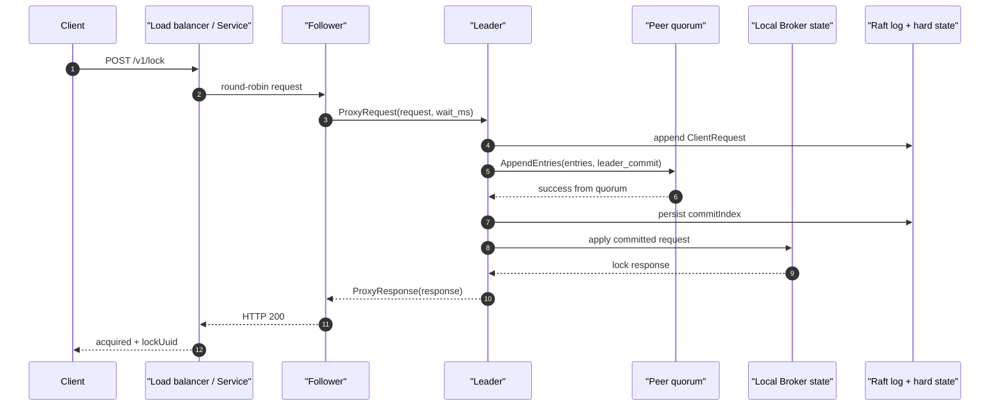
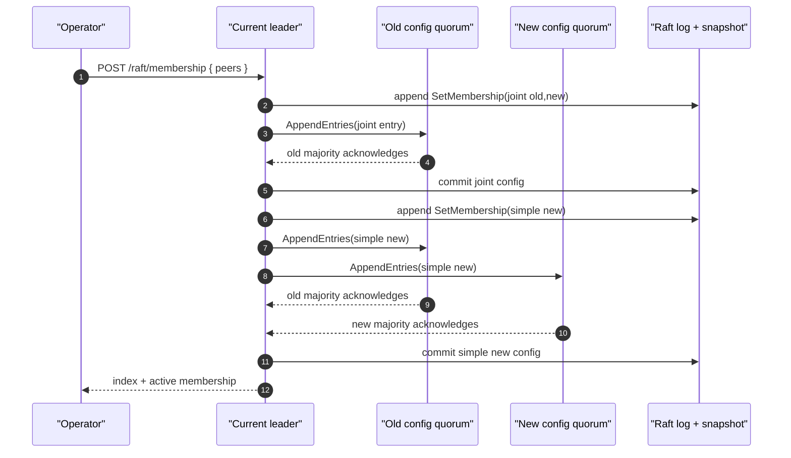
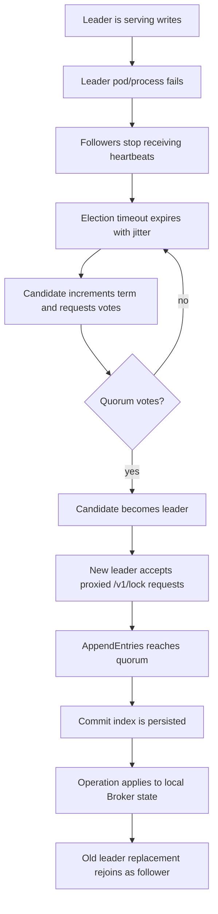

# BrokerRaft Architecture

BrokerRaft is the high-availability HTTP backend for `live-mutex-rs`.
It is a separate deployment from the regular single-node Broker: the
regular Broker keeps the TCP + HTTP API on one pod, while BrokerRaft runs
three or five HTTP-only pods with a Raft RPC peer service.

The leader orders lock operations. A quorum commits each operation before
the in-process broker state is changed. Followers can receive HTTP lock
requests from a round-robin load balancer and proxy them to the current
leader.

## Implementation Status

BrokerRaft is a real Raft-shaped broker path, but it is not yet an
etcd/ZooKeeper-grade consensus system.

Implemented:

- leader election with `RequestVote`,
- leader-ordered lock operations,
- quorum commit based on peer count, such as 2-of-3 or 3-of-5,
- durable local hard state and append-only logs,
- incremental `AppendEntries` with `prevLogIndex`, `prevLogTerm`,
  `nextIndex`, `matchIndex`, and bounded catch-up batches,
- follower log conflict detection and truncation repair,
- `InstallSnapshot` catch-up for followers behind the compacted prefix, limited
  to the current idle-broker snapshot format,
- log-backed dynamic membership changes through joint consensus via
  `GET/POST /raft/membership`,
- persistent Raft peer connection reuse for vote, append, and snapshot RPCs,
- leader-aware HTTP routing support via `/raft/leaderz`,
- conservative local snapshot/compaction for disk control.

Still missing:

- full non-idle broker state snapshots and restore,
- learner/staging workflows for adding a cold node before it is promoted to a
  voter,
- request batching and pipelining for the hot path,
- production hardening comparable to etcd or ZooKeeper,
- broader snapshot transfer mechanics such as chunking and checksums.

That means BrokerRaft should currently be treated as an experimental
high-availability broker backend, not as a finished distributed lock service.

## State Diagram

## Lock Commit Sequence

If the load balancer can prefer the leader, it should use
`GET /raft/leaderz` as the leader-only health check. That removes the proxy
hop shown above. Correctness does not depend on leader-aware routing, because
followers proxy writes and the leader still requires quorum before applying.
The current leader write path is still serialized, and each committed lock
operation is durably written before applying. Followers now receive incremental
log suffixes instead of a full-log rewrite on every append. Lagging followers
receive bounded `AppendEntries` batches, controlled by
`append_entries_max_entries` and `append_entries_max_bytes`, and Raft peer RPCs
reuse open TCP connections. This path is still correctness-first rather than
throughput-optimized because writes are serialized and not yet batched or
pipelined.

## Membership Change Sequence

The joint entry is committed using the old config. Once that entry is applied,
the final simple config must be acknowledged by a majority of both the old and
new configs. This is Raft's quorum safety rule; it does not remove the leader's
job of ordering operations.

## Failover Event Trace

## Log Compaction Rule

BrokerRaft does not delete old committed log entries just because they are
older than a wall-clock threshold. Instead it writes a durable snapshot and
compacts entries only when all of these are true:

- the entries are committed,
- the entries are applied,
- the snapshot covers the compacted index,
- the local Broker state is idle.

That conservative rule saves disk during idle periods while preserving replay
safety for live locks and waiters.
